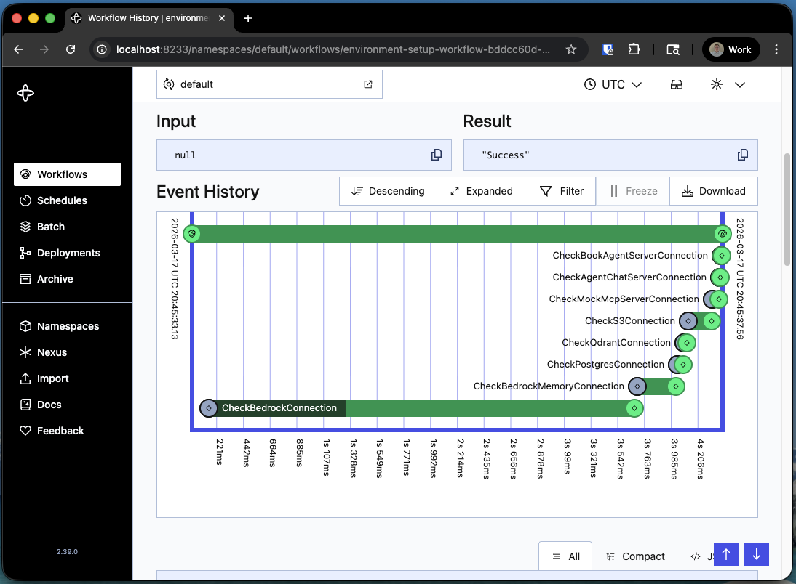

## Goals

Verify your local development environment is set up correctly for the workshop exercises.

## Prerequisites

1. [Docker](https://www.docker.com/products/docker-desktop/)
1. [Amazon Corretto Java 21](https://docs.aws.amazon.com/corretto/latest/corretto-21-ug/downloads-list.html)
1. [Maven](https://maven.apache.org/download.cgi)
1. [VSCode](https://code.visualstudio.com/) with the [Extension Pack for Java](https://marketplace.visualstudio.com/items?itemName=vscjava.vscode-java-pack) (other IDEs work, but launch configurations are provided for VSCode)
1. [Postgres](https://www.postgresql.org/download/)
1. AWS Access Key, Secret Access Key, Session Token, and Region with the permissions and resources required for this workshop (provide your own)
1. AWS Bedrock Memory Id and Region (provisioned for you prior to the workshop)
1. Brave Search API Key (optional; useful for open-ended agent queries — ask the organizers)

## Environment Variables

Copy `.env.example` to `.env` in the repo root and fill in any values marked `todo`. The root `.env` is automatically copied into each exercise directory when building or running. If needed, manually run the **Sync Environments** task in VSCode.

## External Systems

- **AWS Bedrock** — hosts the LLM and embeddings model
- **AWS AgentCore Memory** — stores agent memory
- **AWS S3** — document storage for policy/rubric documents and temporary files

## Local Systems / Mocks

Run via the **Docker Compose Up** task; stop and clean up with **Docker Compose Down**.

- **Temporal** — orchestration layer for AI workflows
- **Qdrant** — vector database for RAG embeddings
- **Postgres** — relational storage for extracted ticket data
- **Agent Chat Server** — Web UI for interacting with agents
- **Mock MCP Server** — used in exercise 4
- **Support Agent Server** — used for agent-to-agent communication in exercise 8

Open the VSCode 'Run Task' menu with `Cmd+Shift+P` (Mac) or `Ctrl+Shift+P` (Windows/Linux) and type "Run Task".

## VSCode Launch Configurations

Each exercise has at least two launch configurations — one to start the Temporal Worker, and one to start a Workflow via a Temporal Client. Access them from the Run and Debug view:

## Solution

To verify your environment:

1. Set up your `.env` file
1. Start local services with **Docker Compose Up**
1. Launch `Exercise 0 - Worker`
1. Launch `Exercise 0 - Client`
1. Visit the [Temporal UI](http://localhost:8233) and confirm the workflow executed successfully

