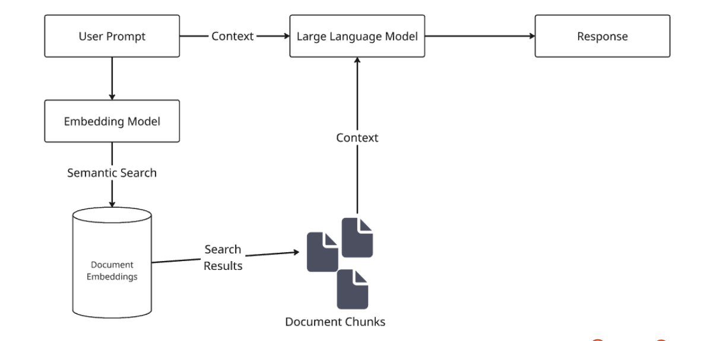

# Exercise 2 - Retrieval Augmented Generation

## Goals

The goal of this exercise is to understand how information from documents, webpages, code, etc can be converted to a numerical representation, stored in a vector database, and retrieved for use in the LLM context.

## What you need to know

Retrieval-Augmented Generation is a technique that enhances the performance of LLMs by combining their generative capabilities with information from external sources. This allows the model to access relevant information from databases, documents, or the web and use it to form a more acurate and contextually informed response.

This can be especially useful for adding domain specific information from an organizations internal knowledge base, without needing to retrain or fine-tune the base model.

Working with LLMs tends to introduce challenges like

- Presenting false information when the topic is not well defined in the training data.
- Presenting out-of-date or generic information when the user wants a specific, current response.

RAG can improve the generated text output from the model in both of these areas by providing authoritative and up-to-date information from a predetermined knowledge source.

## How it works

If we start with a bunch of documents, we first need to break them down into a manageable size. We need to take chunks of the document and convert them into some format that we can work with more easily, and store that representation of the text somewhere.

Then, when the user asks a question, wen eed to (optionally) take that question, search our new datastore for chunks of text that are relevant to the question, and then provide that additional information to the model as part of its context.

General flow:

-We run the users question through the same embedding model that we used to process our documents
-We then use semantic search against our vector database to fetch the most relevant document chunks
-We return those chunks, along with the original user prompt, and put both into our context
-We feed that context into the model
-The model returns us a response



### Document Splitting

When creating the vector representation of the text, it is often necessary to split the document into smaller chunks. LLMs are limited in the amount of text they can process at once, their context length, so splitting up the text into smaller pieces is necessary to ensure we can work only with the most relevant parts of the document.

LangChain (https://docs.langchain4j.dev/tutorials/rag/#document-splitter) is a popular framework for building applications with LLMs and it provides a variety of tools and utilities for working with text, including document splitting. There are many different strategies for splitting text. In our examples we will use the LangChain4j DocumentByParagraphSplitter, which provides a flexible way to split text by paragraphs.

Other options include:

- DocumentByLineSplitter
- DocumentBySentenceSplitter
- DocumentByWordSplitter
- DocumentByCharacterSplitter
- DocumentByRegexSplitter

When you instantiate a DocumentSplitter you can specify the chunk size and the amount of overlap between chunks. The chunk size determines how many characters or words are in each chunk. The overlap determines how many characters or words are shared between adjacent chunks. This can be useful for ensuring that important context is not lost when splitting the text.

Tuning these parameters based on the structure of your documents can help improve the quality of the generated text.

One useful tool for visualizing the chunks created by a DocumentSplitter is [ChunkViz](https://chunkviz.up.railway.app/). This tool allows you to see how the text is split into chunks and how the overlap is applied. It can help you understand how the DocumentSplitter is working and how to adjust the parameters for better results. You can even upload your own text to visualize how it is split into chunks.

### Embeddings

https://docs.aws.amazon.com/bedrock/latest/userguide/titan-embedding-models.html

Embedding models are used to convert text into vector representations. These vectors capture the semantic meaning of the text and can be stored in a vector database for efficient retrieval. There are many different embedding models available. For these examples, on AWS Bedrock, we will use the `amazon.titan-embed-text-v2:0` model. The Amazon Titan Text Embedding v2 model can take an input of up to 8,192 tokens or 50,000 characters and outputs a vector of 1,024 dimensions. The model is optimized for text retrieval tasks such as RAG, classification, and document search and is optimized for English, but does also support 100+ other languages.

Vector databases are specialized databases designed to store and retrieve vectors efficiently. They use techniques like approximate nearest neighbor search to quickly find the most similar vectors to a given query vector. This allows for fast retrieval of relevant information from large datasets. In our examples, we will use Qdrant, a popular open-source vector database that provides efficient storage and retrieval of vectors.

There are many other vector databases available, along with plugins that add vector support to existing databases such as PostgreSQL or even SQLite.

### Prompting and Context Length

As we learned in the previous exercise on Prompt Engineering, LLMs depend on a System Prompt to define the role of the model, the type of response we expect, and as a place to provide any additional information that is relevant to the task at hand. In the case of RAG, we can use the System Prompt to provide information that we retrieve from the vector database.

Building up a basic System Prompt might look like this:

```text
You are a helpful assistant that provides information about building AI Agents with Temporal. You will answer questions about building AI Agents with Temporal and provide information from the provided context. The context is provided in the form of documents, webpages, or other sources that have been converted into a vector representation and stored in a vector database.

Additional Context:
{context}

If you do not know the answer, say "I don't know" instead of making up an answer. Keep your answers to a couple paragraphs if possible, separated by newlines, and use Markdown formatting when appropriate.
```

This prompt defines the role of the model, the type of response we expect, and provides a placeholder for the context that will be retrieved from the vector database. The `{context}` placeholder will be replaced with the relevant information from the vector database when the model is called.
