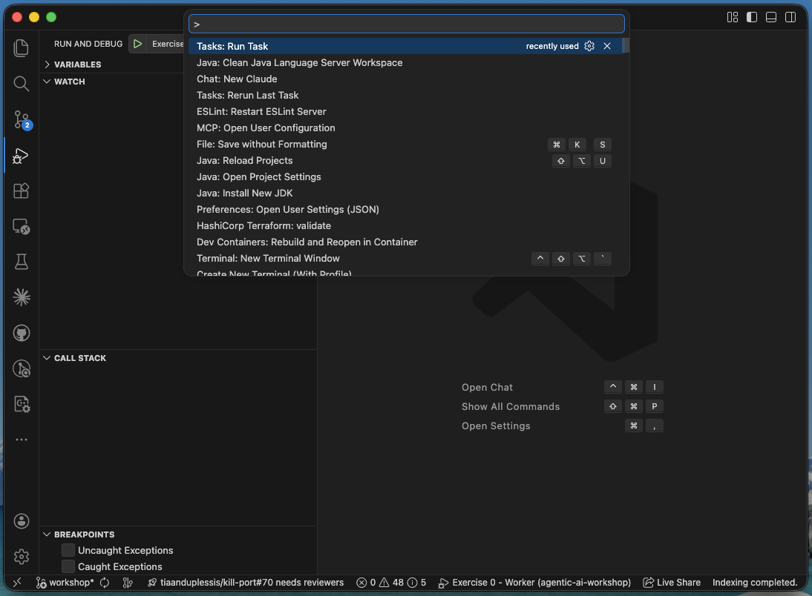
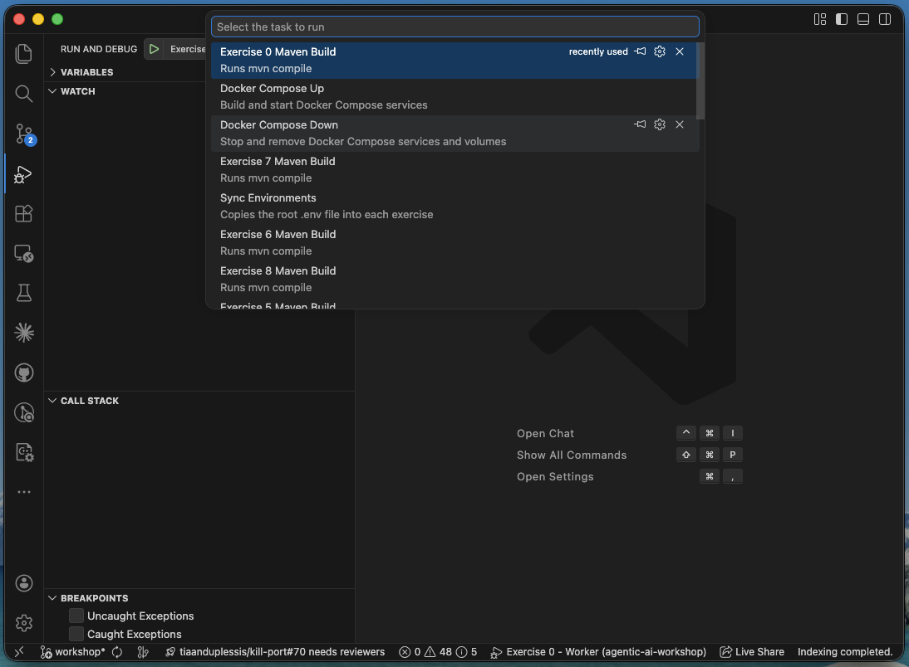
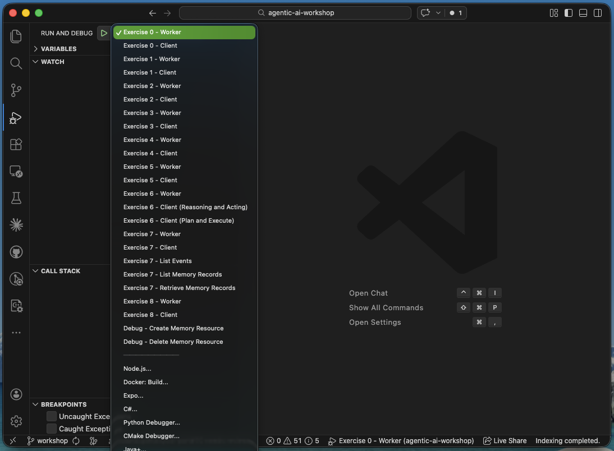
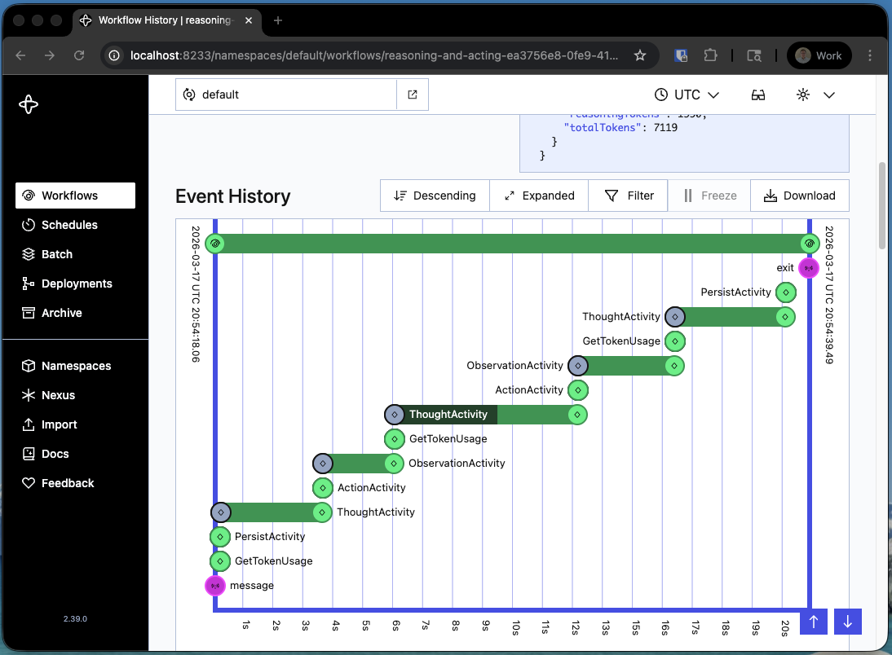
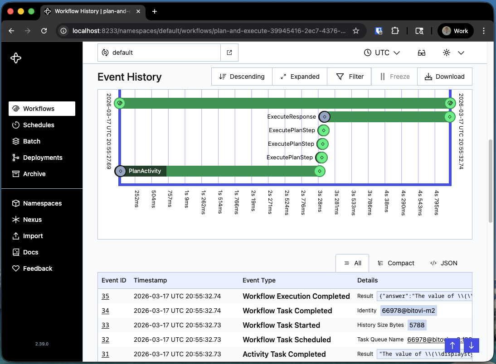

# Agent Decisions Exercise

## Part A - Initial Example

First let's run the existing implementation of a ReAct ("Reasoning and Acting") Agent. This is very similar to what we built in Exercise 5.

0. Run Task: Sync Environments
1. Run Task: Docker Compose Down
2. Run Task: Docker Compose Up

You can access the VSCode 'Run Task' menu by pressing `Cmd+Shift+P` (Mac) or `Ctrl+Shift+P` (Windows/Linux) and typing "Run Task".


Select the appropriate task from the list to run.

- Sync Environments
- Docker Compose Down
- Docker Compose Up



3. Launch: Exercise 6 - Worker
4. Launch: Exercise 6 - Client (Reasoning and Acting)

You can access the VSCode 'Run and Debug' panel by pressing `Cmd+Shift+D` (Mac) or `Ctrl+Shift+D` (Windows/Linux) and selecting the appropriate launch configuration.

At the top of the panel, you can select the configuration to launch.


Let's open the latest workflow in the [temporal ui](http://localhost:8233/) so we can observe that behavior of the agent.

Notice how the workflow loops through the THOUGHT, ACTION, and OBSERVATION activities.

Click on individual activities to inspect the input and output of each step.



Notice how the result for each activity includes a `usage.reasoningTokens` value.

Example:

```json
  "usage": {
    "inputTokens": 1249,
    "outputTokens": 309,
    "reasoningTokens": 180,
    "totalTokens": 1558
  }
```

This value reflects the number of tokens that the model spent while performing it's own internal reasoning before returning a response.

Note that the workflow result includes it's own `usage.reasoningTokens` value which represents the sum of all the activities' reasoning tokens.

```plain
Workflow completed!
Usage metrics:
  Input tokens: 5725
  Output tokens: 2053
  Reasoning tokens: 1594
  Total tokens: 7778
```

## Part B - Plan and Execute Example

Now lets try an example implementation of a Plan and Execute Agent. This time we have a single planning phase and then a separate execution phase. The execution phase does not perform any reasoning of its own, it simply executes the plan that was created during the planning phase.

0. Run Task: Sync Environments
1. Run Task: Docker Compose Down
2. Run Task: Docker Compose Up

You can access the VSCode 'Run Task' menu by pressing `Cmd+Shift+P` (Mac) or `Ctrl+Shift+P` (Windows/Linux) and typing "Run Task".


Select the appropriate task from the list to run.


3. Launch: Exercise 6 - Worker
4. Launch: Exercise 6 - Client (Plan and Execute)

You can access the VSCode 'Run and Debug' panel by pressing `Cmd+Shift+D` (Mac) or `Ctrl+Shift+D` (Windows/Linux) and selecting the appropriate launch configuration.

At the top of the panel, you can select the configuration to launch.


Let's open the latest workflow in the [temporal ui](http://localhost:8233/) so we can observe that behavior of the agent.

Notice how the workflow this time has a single planning phase followed by a separate execution phase, rather than looping through THOUGHT, ACTION, and OBSERVATION activities.

Click on individual activities to inspect the input and output of each step.



Note that the workflow result includes it's own `usage.reasoningTokens` value. This time it represents the reasoning tokens used during the single planning phase, as the execution phase does not perform any reasoning.

```plain
Workflow completed!
Usage metrics:
  Input tokens: 1437
  Output tokens: 1149
  Reasoning tokens: 949
  Total tokens: 2586
```

For this simple math problem example, the Plan and Execute Agent uses only 2500 tokens total compared to the 7700 tokens used by the ReAct Agent!

## Part C - Experiment

Search for `TODO_DECISIONS` in the code:

- TODO_DECISIONS: Experiment with different word problem prompts

  In the `6-agent-decisions/java/src/main/resources/word-problems` directory there are a variety of different questions that you can experiment with.

  Try swapping out the existing prompt with a different one and see how it affects the agent's behavior.

  You can update the file name in `6-agent-decisions/java/src/main/java/bitovi/AgentDecisionsClient.java`.

  You can swap between the Plan and Execute agent and the ReAct agent by selecting the corresponding 'Exercise 6 - Client' in the VSCode Launch options. Try both on the different problems and see how each approach performs.

- TODO_DECISIONS: Experiment with changing the max reasoning effort (low, medium, high)

  What effect does this have on the agent's behavior? Does it use more reasoning tokens? Does it perform better or worse on the task?
