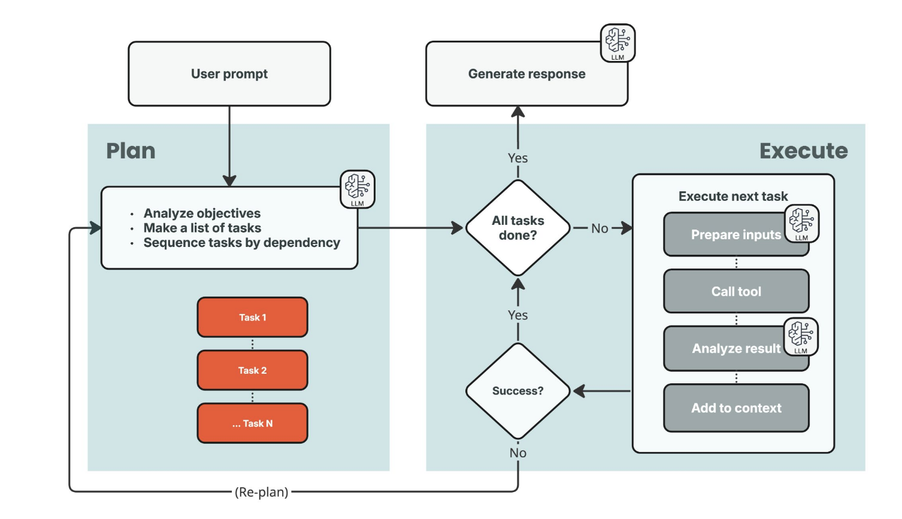

# Exercise 6 - Agent Reasoning

## Goals

The goal of this exercise is to understand how different agent decision strategies can be implemented and how they affect the behavior of an LLM-based Agent.

- **Reasoning and Acting (ReAct) Agent Architecture:** Structure agents to both reason about problems and take actions (e.g., calling tools, asking clarifying questions) to solve them.
- **Plan and Execute Agent Architecture:** Structure agents to generate a complete plan before executing it step by step.
- **Model Provider Reasoning Effort:** Explore how much reasoning the model provider (OpenAI, Anthropic, Bedrock, etc.) does before returning a response.
- **Techniques for Optimizing Decision Making:** Learn methods to improve agent consistency, reliability, and performance.

## What you need to know

### How it works

Take a look at a few different strategies for agent decision making, and how they affect the behavior of the agent.

#### Reasoning and Acting Agent Architecture

ReAct (Reasoning and Acting) is a way to enable LLMs to combine Chain of Thought and multi-step reasoning with tool use, allowing the model to iterate on a problem until it is solved. Rather than following a predefined workflow, ReAct relies on the LLM's reasoning capabilities to dynamically adjust its approach based on new information gathered from previous steps.

This enables the LLM to think aloud, plan the next steps, use tools to fetch information or interact with external systems, and then observe the resulting state (context) that it has collected. This cycle of **Thought → Action → Observation** is the reasoning and acting loop.

As we saw in Exercise 5, we can build an agent workflow that runs multiple iterations of a reasoning and acting loop, allowing the model to call tools, collect information, ask clarifying questions, and then generate a final response.

Each step in the loop has a specific role:

- **Thought:** This is where we give the agent a place to literally think about what it needs to do next, based on the current state of the context and the original question. Looking at the available tools and the information already gathered, the Thought step returns either an **Action** to take next, or a final **Answer** if the agent has enough information to respond.
- **Action:** If the Thought step returned an Action, we execute it. An Action is a call to one of our defined tools with the inputs the model decided on (returned as a structured output from the LLM). The raw result of that tool call is then passed along to the Observation step.
- **Observation:** Tool results are often noisy or larger than we need. The Observation step uses an LLM to extract or summarize the important information from the tool's output and incorporates it back into the context. That updated context then feeds into the next Thought, closing the loop until the agent produces a final Answer.

The Workflow runs through this Thought → Action → Observation loop as many times as needed, with every thought, action, and observation accumulating into the LLM's context. Because the LLM is involved at each step, the agent stays adaptive across iterations — making ReAct flexible, easy to implement, and easy for humans to reason about.

We can optimize cost by using different models for different steps: a top-tier reasoning model for **Thought** (complex decision making, planning) and a smaller, faster model for **Observation** (summarizing or extracting facts from tool output).

```ts
interface ThoughtResult {
  reasoning: string;
  action?: Action;
  answer?: string;
}

interface Action {
  name: string;
  input: Record<string, any>;
}
```

The Activities in our ReAct Agent Workflow look like this:

```ts
interface Activities {
  // Takes the context of the conversation, available tools, thinks about the first action
  thoughtActivity(context: string[], availableTools: Tool[]): ThoughtResult;

  // Takes the tool and input, executes the action
  actionActivity(toolName: string, input: ActionInput): string;

  // Takes the observation from the action and updates the context
  observationActivity(context: string[], result: string): string;
}
```

#### Plan and Execute Agent Architecture

Plan and Execute separates the 'thinking' steps from the 'doing' steps. The LLM acts as a sort of compiler — looking at the complex question, breaking it down into a sequence of tool calls, then letting the executor take it from there. The core loop is: **Plan, Execute (step-by-step), Evaluate, and optionally Re-Plan**.

Because planning is decoupled from execution, we can use our most powerful reasoning model for the planning step while the tool calls and result parsing in execution can be handled by fast, cheap models — or, in many cases, no LLM at all.

The single most important output of the Planning step is the **dependency map** between steps — which steps need results from which earlier steps. This map tells the executor what order steps must run in and, just as importantly, which steps can run in **parallel**.

If we take a look at this in diagram form, we can see the two major sides of the flow:



Plan on the left, Execute on the right. The link between them is the list of tasks the Plan hands off. The execution phase processes those steps until they're all complete, then a final LLM call generates a response. Often the entire Execute phase can run without an LLM at all; if a step does need one, the input stays small because it only sees its own task and any tasks it depends on.

The data structure the Planner produces is a **Directed Acyclic Graph (DAG)**:

- **Nodes** = individual tasks or sub-goals.
- **Edges** = dependencies (this task requires the output of that task).
- **Acyclic** = no cycles, so the plan always progresses forward and terminates.

A DAG captures the reality that some steps are independent and can run in parallel, while others have genuine dependencies on earlier outputs. Each step has a tool name, inputs, and a list of `stepId`s it depends on. As dependencies resolve, their outputs are substituted into dependent steps' inputs. Independent branches can run in parallel; dependent branches wait for their inputs.

Producing a DAG reliably depends on the model giving us great structured output (JSON or similar). Here's what the execution loop looks like:

```java
List<String> context = new ArrayList<>();
context.add(formatUserMessageContext(msg));

PlanResponse plan = activities.planActivity(context);
PlanStatus status = buildPlanStatus(plan);

// Main event loop
while (true) {
    if (hasFailedDependencies(status)) {
        return activities.executeResponse(context); // Here we should re-plan, or after a certain number of retries, give up.
    }

    List<PlanStep> pending = filterStepsWithMetDependencies(plan.steps(), status.results(), status.failed());
    if (pending.isEmpty()) {
        break;
    }

    List<Promise<PlanStepResult>> promises = new ArrayList<>();
    for (PlanStep step : pending) {
        List<PlanStepResult> deps = collectDependencies(step, status.results());
        promises.add(Async.function(activities::executePlanStep, step, deps));
    }
    List<PlanStepResult> results = collectResults(promises);

    for (PlanStepResult result : results) {
        if (!result.error()) {
            context.add(formatPlanStepResultContext(result));
            status.results().put(result.id(), result);
        } else {
            context.add(formatFailedPlanStepResultContext(result));
            status.failed().add(result.id());
        }
    }
}

return activities.executeResponse(context);
```

The flow: seed the context with the user's question, call **`planActivity`** with a strict prompt that defines the JSON format and available tools, then track each step's state in a `PlanStatus`. The execution loop filters for steps whose dependencies are met and dispatches them to `executePlanStep` in parallel via Temporal Activities. Successful results merge back into the context; failures go into `status.failed`. Once the loop drains, **`executeResponse`** uses the LLM one final time to format everything into the user-facing response. (For simplicity this version skips Re-Planning.)

##### Example

For the question _"What is the number of daily League of Legends players, and what is that number times the distance from the Earth to the Sun?"_, the Planner produces:

```json
[
  {
    "id": 1,
    "tool_name": "Search",
    "tool_input": "Number of daily League of Legends players",
    "result_type": "number",
    "dependsOn": []
  },
  {
    "id": 2,
    "tool_name": "Search",
    "tool_input": "Distance from the Earth to the Sun",
    "result_type": "number",
    "dependsOn": []
  },
  {
    "id": 3,
    "tool_name": "Calculator",
    "tool_input": "{{result:1}} * {{result:2}}",
    "result_type": "number",
    "dependsOn": [1, 2]
  },
  {
    "id": 4,
    "tool_name": "Answer",
    "tool_input": "{dailyLeague: {{result:1}}, distanceToSun: {{result:2}}, product: {{result:3}}}",
    "result_type": "string",
    "dependsOn": [1, 2, 3]
  }
]
```

```text
Execute: (dependsOn: [])

    Search["Number of daily League of Legends players"] ==> 15000000
    Search["Distance from the Earth to the Sun"] ==> 93000000

Execute: (dependsOn: [1,2])

    Calculator["15000000 * 93000000"] ==> 1395000000000000

Execute: (dependsOn: [1, 2, 3])

    Answer["The number of daily League of Legends players is 15 million, and the distance from the Earth to the Sun is approximately 93 million miles. The product of these two values is 1395 million."]
```

Steps 1 and 2 have no dependencies and run in parallel. Step 3 references their outputs via **placeholders** (`{{result:1}}`, `{{result:2}}`) instead of hardcoded values. The Executor often needs no LLM at all — deterministic Workflow code can run the tasks in dependency order and substitute outputs into later inputs. A lightweight LLM call may still be useful to coerce a tool's output into the exact shape the next step needs, but those calls remain much smaller than ReAct's Observation step.

##### Prompting the Planner

Producing a DAG reliably requires a strict prompt and **Structured Output** (a JSON Schema the response is validated against). The prompt must tell the model:

- The user's goal.
- The available tools, including their inputs **and outputs**.
- To break the goal into numbered steps tracked individually.
- To use placeholders referencing prior step outputs rather than guessing values.
- To maintain the dependency chain between steps.

Tool definitions matter just as much as the prompt. If a user asks for the current wind speed in Rochester, NY but our Weather tool doesn't expose wind speed, the Planner can only know that from clearly described tool outputs. Take the League of Legends example: the Planner only knows it needs to look up two separate numbers before multiplying them because the Calculator and Search tools have well-defined inputs and outputs.

##### Re-Planning and Trade-offs

If a step fails or returns the wrong type, dependent steps can't run. We call the Planner again, passing in which steps succeeded, which failed, and the current outputs, asking for a fresh plan. After some retry limit, we give up.

The structural contrast with ReAct: ReAct's `thoughtActivity` decides the next action every iteration with the full context in view, which makes it flexible and adaptive. Plan and Execute generates the full sequence upfront, then iterates through it deterministically. For a 5-step task, ReAct might make 10+ LLM calls; Plan and Execute typically makes 2–3, with much smaller token counts per call. The trade-off is dynamism: when something unexpected happens mid-execution, Plan and Execute has to re-plan, while ReAct just adapts on the next iteration.

#### Model Provider Reasoning Effort

Everything we've talked about so far has been about building a system _around_ the LLM that lets us construct and manage the "thought" or "plan" the model uses to solve a problem. But there are other layers of reasoning we can take advantage of — what if the model itself could think internally and reason before answering?

Older LLMs generated tokens in a single pass, relying entirely on their training and the prompt to predict the next token. Agent loops and external Chain of Thought scaffolding turned out to be so effective at improving output that LLM providers started training models to generate "reasoning tokens" before producing any visible text.

These reasoning tokens aren't magical. They give the model an internal notepad to explore approaches, plan, and self-correct before committing to an answer. The model is still just generating text — but structured the way a person might reason about a problem instead of jumping straight to an answer. This makes it more likely that relevant information from the context and training data surfaces during thinking and gets incorporated into the final response.

Most modern models support this — OpenAI, Anthropic, Gemini, and locally-run models like Qwen and DeepSeek. The process is commonly called **Chain of Thought (CoT)**, and it produces more accurate results on tasks involving math, logic, planning, or multi-step decision making.

Many providers (OpenAI, Anthropic, Bedrock) expose API arguments to control how much CoT the model does. This pairs well with the **Thought** step of ReAct: layering the model's internal CoT with the explicit reasoning step the workflow enforces between calls. For Observation or context-compact steps, we usually want less reasoning to save latency and cost.

AWS Bedrock:

```java
Document reasoningConfig = Document.mapBuilder()
        .putDocument("reasoningConfig", Document.mapBuilder()
                .putString("type", "enabled")
                .putString("maxReasoningEffort", "low")
                .build())
        .build();
requestBuilder.additionalModelRequestFields(reasoningConfig);
```

OpenAI:

```java
ChatCompletionRequest request = new ChatCompletionRequest.Builder()
        .model("gpt-5.1") // Must be a reasoning model
        .messages(List.of(new ChatCompletionResponseMessage.Builder()
                .role("user")
                .content("Explain the theory of relativity in simple terms.")
                .build()))
        // Set the reasoning effort parameter
        .reasoningEffort(ReasoningEffort.HIGH) // Or LOW, MEDIUM, XHIGH, etc.
        .build();
```

##### Why might we NOT want this?

Internal reasoning isn't free. **Reasoning tokens count against output token usage** even though we never see them, and output tokens are billed at a higher rate than input. Latency also increases because the model generates all those reasoning tokens before emitting the visible response.

That's why providers let us tune effort by use case:

- **Low effort:** simple text summarization, observation steps.
- **High effort:** Planning phase of a Plan and Execute agent, where strict structured output and complex decomposition matter.

##### Reasoning Tokens Example

I asked a Qwen reasoning model running locally the prompt _"Can you tell me about LLM reasoning tokens?"_. The visible answer was about 11 lines / 238 output tokens — but before producing those, the model emitted **62 additional lines, ~1,000 reasoning tokens** of internal thought.

What's interesting is what's actually in those reasoning tokens. The model sets a goal, breaks the request down, holds the system prompt's persona in mind, and considers multiple interpretations of "LLM reasoning tokens." It then drafts the response — planning what each paragraph should contain, working through bullet points, drafting most of the answer, and even leaving itself reminders about final polish (like ending each paragraph with two newlines).

The visible outputs from two different models:

**Qwen 3.5:9b:**

```text
Hey there! That's a really interesting question about LLM Reasoning Tokens. While they aren't special symbols like `<B>` or `</S>`, these tokens refer to the
sequence of words a model generates when it performs Chain-of-Thought reasoning. Basically, instead of jumping straight to an answer, the model outputs intermediate
steps that show its logical deduction process before finalizing the output.

When a model encounters a complex task—like solving a math problem or deciphering a logic puzzle—it often uses these reasoning tokens to break down the issue into
smaller parts. This is why you sometimes see models pause and "think" aloud in text; that's simply a series of standard tokens representing internal logic rather
than final information. It allows the model to self-correct and improve accuracy before responding to the user.

The importance of these tokens lies in efficiency and quality. Researchers are always studying how many reasoning steps a model needs versus when it has thought
enough, which is crucial for managing computational costs. While tokenization varies by model architecture, optimizing this "thinking" budget is a major focus in
advanced AI development right now to make models smarter without wasting too much compute!
```

**GPT-OSS 20b:**

```text
Large Language Models (LLMs) like GPT‑4 don’t “see” words as whole units; they operate on **tokens**—sub‑word pieces produced by a tokenizer (e.g., Byte‑Pair
Encoding or SentencePiece). A token can be a full word, part of a word, or even punctuation. The model’s attention, self‑attention, and hidden states are all
computed over these token embeddings.

When people talk about **“reasoning tokens”**, they’re usually referring to the tokens that comprise the model’s step‑by‑step reasoning when it generates an answer.
For instance, if a user asks a math problem, the LLM might output:

Step 1: …
Step 2: …
Answer: …

Each word or sub‑word in that explanation is a token. There isn’t a special “reasoning” token type—rather, the model is conditioned (via prompt engineering or
instruction tuning) to produce a chain of reasoning, and the resulting tokens are just normal tokens that happen to form a logical sequence. Understanding token
counts is important because the cost and latency of a request depend on how many tokens are sent in the prompt plus how many the model produces.
```

#### The Future of Model Reasoning

Some of the most interesting recent research explores reasoning **without natural-language output at all**. A meaningful portion of the current reasoning-token budget goes toward maintaining linguistic fluency rather than advancing the reasoning itself. If models could reason directly in their latent embedding space, they might do even better.

Notable papers:

- **"Training Large Language Models to Reason in a Continuous Latent Space" (COCONUT)** — Hao et al., Nov 2025 (Meta). Uses the LLM's last hidden state as a "continuous thought" representation, fed back as the next input embedding directly in continuous space. A nice side effect: it can encode multiple alternative next steps simultaneously, enabling breadth-first reasoning.
- **"Reasoning Beyond Language: A Comprehensive Survey on Latent Chain-of-Thought Reasoning"** — May 2025. Categorizes latent reasoning into **intrinsic** (single LLM) and **auxiliary** (separate module generating continuous tokens) approaches; covers COCONUT, HCoT, CCoT, SoftCoT, CoCoMix.
- **"Demystifying Long Chain-of-Thought Reasoning in LLMs"** — February 2025. How SFT and RL contribute to extended reasoning chains.

#### Instruction Tuning

How do providers actually get a model to output reasoning tokens? Through **instruction fine-tuning**.

In their raw form, **foundation models** are giant next-token predictors trained on roughly all of human-readable text. After pretraining, all the model knows how to do is predict the next token. **Instruction tuning** adapts the model for practical use: instead of training on raw text, it uses curated input/output pairs. After thousands or millions of examples, the model learns what users actually want, when to call tools, and how to format responses. This is also where reasoning-token behavior gets baked in — by showing the model many examples of "showing its work" before answering.

A nice illustration from [Dave Bergmann at IBM](https://www.ibm.com/think/topics/instruction-tuning): given _"teach me how to bake bread,"_ a base foundation model might continue with _"in a home oven."_ An instruction-tuned model recognizes the user wants an actual recipe and responds accordingly.

#### AWS Bedrock Fine-tuning

AWS Bedrock lets us create fine-tuning jobs to customize supported models, via the AWS Console or the `boto3` Python library. Reinforcement fine-tuning supports up to **20,000 examples** per job (see the [Bedrock RFT documentation](https://docs.aws.amazon.com/bedrock/latest/userguide/rft-nova-models.html)).

Each example uses two key fields:

- **`messages`** — the user/system/assistant input prompt.
- **`reference_answer`** — the expected output or evaluation criteria your reward function uses to score the response.

#### Long Context Reasoning

Long context lengths impact reasoning capabilities. To understand why, we need to look at how Transformer models process information — specifically, the self-attention mechanism.

_Attention is All You Need_

The Transformer breakthrough described in the 2017 Google paper is the **self-attention** mechanism: each token computes an "attention score" against every other token, determining how much each one influences the others' representations. Attention is how the model decides what to pay attention to.

Attention scores are computed via **softmax** across all tokens in the context window. Softmax is competitive: it converts raw relevance scores into a probability distribution that sums to 1. If one score goes up, others must go down. So in a 200K-token context, every token competes against 199,999 others for a fixed attention budget — which is why **attention dilution** becomes a real problem at long context lengths.

_Context Rot_

"Context rot" is a term coined by Anthropic for the phenomenon where model quality degrades as context length increases. The reality is more nuanced than "more tokens = worse performance." Frontier models actually score 90%+ on needle-in-a-haystack benchmarks like RULER even at very long contexts — they can _find_ information in large contexts. The degradation shows up on tasks that require **reasoning over** large contexts: aggregating across thousands of entries, tracking state changes, synthesizing distributed evidence. The model can find any individual piece of information but struggles to hold and manipulate many pieces simultaneously.

Contributing factors:

- **Attention dilution**: critical relationships between distant tokens get washed out as more tokens compete for the fixed attention budget.
- **Lost in the middle**: models attend more strongly to tokens near the beginning and end of their context, with weaker attention to information in the middle. This "U-shaped" pattern means **how we organize our context matters**.
- **Training data distribution**: models are trained predominantly on shorter sequences. Ultra-long sequences are out-of-distribution at inference time, including for instruction tuning examples.
- **Positional encoding limitations**: techniques like RoPE and ALiBi extend positional awareness, but extrapolating far beyond training lengths still introduces degradation.
- **MoE routing bottlenecks**: in Mixture-of-Experts models, the routing layer can bottleneck at extreme context lengths — the RLM authors noted this was sometimes a bigger factor than attention itself.

_Why This Matters for Agent Architecture_

- **ReAct loops accumulate context.** The model sees the entire conversation history every iteration. After 10 or 100 iterations, the context can grow substantially, and reasoning quality in later iterations may degrade — this is one reason a ReAct agent might "forget" its original goal.
- **Plan and Execute mitigates this by design.** The Planner gets full context, but each execution step ideally runs with no LLM (or a minimal, focused prompt). The trade-off: Plan and Execute is harder for open-ended use cases where you can't plan around data you haven't seen yet.
- **Reasoning effort interacts with context length.** Higher reasoning effort generates more internal CoT tokens, which also consume context and attention budget. For very long contexts, there's tension between deep reasoning and the context pressure CoT creates.

This is a fundamental motivation for multi-agent systems, which we'll cover in later sections.

#### Recursive Language Models: Treating Context as an Environment

Recursive Language Models (RLMs) combine ideas from ReAct and Plan and Execute to address long-context problems. A **Root** language model orchestrates: it does the initial thinking and planning, then splits the problem into sub-queries handed to **Sub-Agents** that work over slices of the context. The Root keeps its own context focused on only what it needs.

The defining trick: instead of feeding a massive context directly into the model, the context is stored as a variable inside a Python **REPL**. The Root uses tool calls to write Python that runs against that environment. From outside, an RLM call looks like a normal LLM call — query in, string out — but internally the model is orchestrating its own recursive decomposition.

With context as a REPL variable, the agent can:

- Peek at subsets (e.g., `print(context[:2000])`)
- Search via regex, keyword matching, or any Python string operations
- Transform with arbitrary Python, extracting pieces into new variables
- Recursively call itself (or a cheaper model) over slices of the data

Sub-Agents are the same as the Root with one restriction: they cannot spawn further Sub-Agents. Each gets a fresh REPL initialized with its assigned chunk and returns its result as a normal value.

The most compelling aspect: the model develops its own data strategies. The RLM paper documents patterns that emerge naturally:

- **Peeking**: inspecting the first few thousand characters to understand structure (like running `head()`).
- **Grepping**: regex/keyword matching to narrow the search space — cheaper and faster than semantic retrieval.
- **Partitioning + Mapping**: chunking and launching parallel recursive sub-calls over each chunk (e.g., classify thousands of entries in groups of 100, then aggregate).
- **Summarization**: condensing intermediate sub-call results before final decisions.
- **Programmatic Solutions**: bypassing the LLM for fundamentally computational portions by writing Python directly.

#### Techniques for Optimizing Decision Making

Given the non-deterministic nature of LLMs, what can we do at the **system level** — around the agent — to steer it toward better outcomes? In our Temporal Workflow there are several places to intervene:

- **Pre-processing**: before a user's message reaches the agent.
- **Post-processing**: guardrails, validation, and escalation after the LLM produces output.
- **Inline retrieval**: RAG and memory inside the agent loop to fetch policies, business rules, or examples.

##### Bayesian Classifiers

Sometimes the best answer is to remove decision making from the LLM entirely and use traditional programming. If we have a fixed set of tools, a Bayesian Classifier can categorize the user's query and map it to the right tool — more efficient and cheaper than asking the model to choose, especially when categories are well-defined.

##### Rule-Based Decisions

Rule-based decision making means **hard-coded business rules running before or after the LLM**. They give us a deterministic safety net for parts of the system where we don't want the LLM making the final call.

For example, a customer-service agent that processes refunds might enforce that the agent **can't issue a refund over $100 without human approval**, plus checks for internal company info leaking into outputs and screens for malicious messages. The LLM handles adaptive problem solving; rules enforce the second layer of validation.

A simple example: `if (applicant.creditScore < 400) { requestManualReview(); }`

To keep things seamless, surface these rules in the agent's prompt or via RAG lookups of policy documents so the agent knows the constraints rather than hitting a wall.

A sophisticated agent typically combines both — deterministic rules for high-frequency, structured tasks and LLM inference for unstructured, adaptive work. In regulated environments (banking, healthcare), rule-based logic also provides auditability and compliance.

**Strengths:** predictable, easy to audit. **Weaknesses:** more up-front design and maintenance effort.

##### Intent Classification

Before the agent sees a message, a small classifier can figure out **what kind of request it is** — refund, billing, account update, FAQ, small talk — and then **tweak the system prompt**, **pare down available tools**, or **route to a different agent** built for that category. Agents perform better with focused context, and intent classification enforces that focus from the start.

**Naive Bayes** is the standard approach (same family used for spam filtering): a probabilistic algorithm that assumes feature independence — mathematically wrong but fast and surprisingly accurate for short-text classification. It can also be implemented with a small fine-tuned model or a single LLM call with a constrained Structured Output schema.

Concrete example: a user typing _"hello"_ doesn't need 20K tokens of context, all tool definitions, and a high-power reasoning model. A lightweight model can respond with _"Hello! How can I help you today?"_ — saving cost and latency for the cases that actually need the full agent.

##### Decision Tables

Sometimes the "decision" is really just a **lookup**. Instead of having the LLM reason over account details on every request, encode the logic in a table — essentially a more complex decision tree across multiple conditions.

For example, for a verified user with a known account age and purchase history, we might **automatically approve refunds under $20**. Decision tables evaluate **multiple conditions simultaneously** to resolve into a single action. They're easy to read, test, and update by people who don't write LLM prompts, and they pair well with Intent Classification — the classifier produces a category, the table produces the action.

##### Optimization Algorithms

LLMs generate by predicting the most likely next token — probabilistic generation. To get better outcomes, we sometimes need strategies that look beyond the immediate next step:

- **Best-of-N**: run the prompt N times, then use a Reward Model or Validator to score and select. Effective for coding/math.
- **Monte Carlo Tree Search (MCTS)**: "look ahead" at consequences before committing, similar to AlphaGo evaluating chess moves.
- **Beam Search**: keep the top 3–5 paths open simultaneously to avoid the greedy-algorithm trap, optimizing for the final outcome rather than the immediate next step.

##### Reinforcement Learning

Reinforcement Learning lets agents improve by learning from past outcomes. When an agent fails — hallucinating a tool's capability, failing a multi-step task — a negative reward signal adjusts its internal policy. Over time, every failure becomes a training data point. In enterprise settings, RL turns the agent into a "digital worker" that learns edge cases rather than staying at its initial performance.

##### Multi-Agent Coordination

Single agents hit reasoning walls — hallucination loops, complex multi-step planning. We can treat AI as a digital team:

- **Collaborative modes:** specialized agents (researcher, writer, critic) debate and verify each other's work for higher accuracy.
- **Competitive modes:** agents are pitted against each other to find flaws or edge cases, using game-theory dynamics for the most resilient decision.

#### Exercise

See [Exercise TODO](./java/TODO.md).
