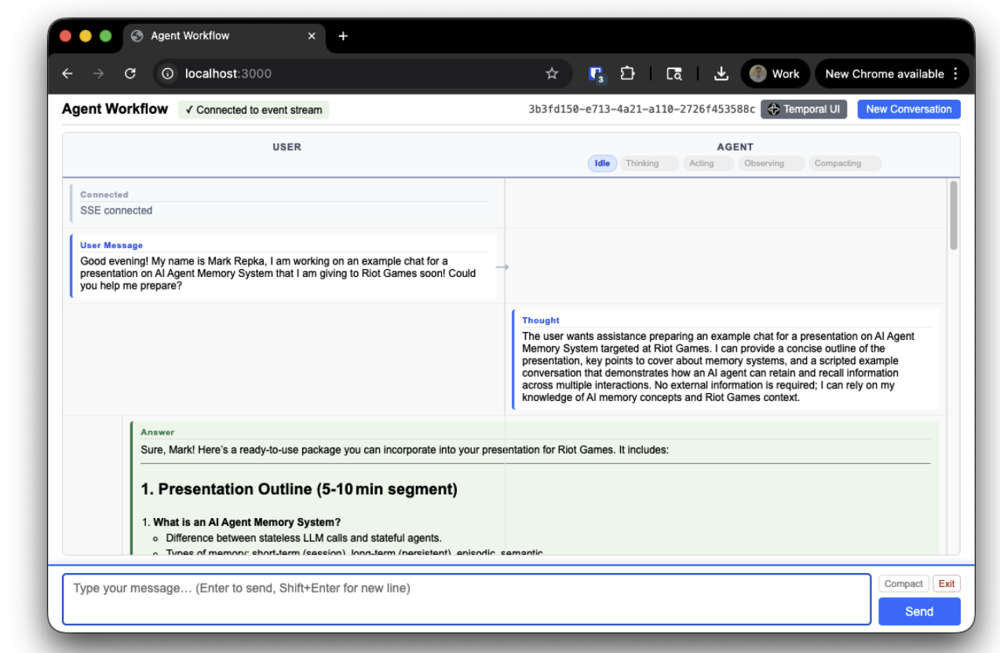
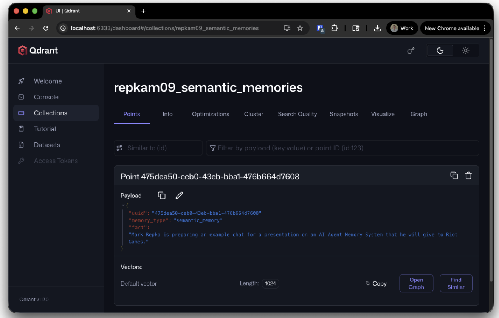

# Exercise 7 - Agent Memory

## Why Memory Matters

Every LLM has a finite context window, a hard limit on how much information it can "see" at once. Without memory management, an agent faces two inevitable outcomes as conversations grow: either it loses information when older context is discarded, or it hits token limits and fails entirely.

This constraint is the fundamental tension that memory architecture exists to solve. A well-designed memory system lets an agent maintain continuity within a conversation, recall relevant information across sessions, and operate indefinitely without degradation.

When working with AI Agents, especially with Temporal, we can design agents that can potentially run for extended periods of time, even indefinitely. This capability opens up exciting possibilities for creating agents that can remember past interactions, learn from them, and adapt their behavior over time.

LLMs themselves are completely stateless, every request stands alone, so it falls on us and our memory management system to keep the context window fed with the information the agent needs. The size of that context window also sets a dual constraint on memory: it caps how much short-term history we can carry between turns _and_ how much long-term memory we can retrieve and inject on any given request. Every memory design decision in this exercise is ultimately about spending that limited budget well.

## Goals

By the end of this exercise, you should understand:

- Why the LLM context window creates the need for memory architecture
- The distinction between working context (what the agent sees now) and persistent memory (what it remembers)
- How short-term and long-term memory work together in a ReAct agent
- The difference between compaction (keeping context small) and memory persistence (extracting durable knowledge)
- How our implementation integrates memory retrieval and persistence into the Temporal workflow
- How AWS Bedrock AgentCore Memory provides an off-the-shelf solution for memory strategies
- Practical concerns: cold starts, token budgets, privacy, and cost

## What You Need to Know

### Context vs. Memory

This is the most important distinction in agent memory architecture. They are related but different:

**Working context** is what the agent can see right now, the full payload assembled and sent to the LLM on a given turn. It is more than just the conversation history. A typical working context includes:

- The **system prompt** that tells the agent how to act, how to respond, and what its output format should be.
- The **tool definitions** that describe what actions the agent is allowed to take.
- The **short-term memory** of the current session: recent user/assistant turns and tool call results.
- **RAG chunks** of documents fetched based on the current conversation.
- **Retrieved long-term memory** records (user preferences, semantic facts, summaries) injected for this turn.

In our implementation, the persisted slice of this, the part we durably track in the workflow, is the `List<ContextEntry>` (short-term memory). The system prompt, tool definitions, RAG chunks, and retrieved LTM records are reassembled on every request to the LLM. All of it together must fit within the context window, and it exists only for the lifetime of the current workflow execution.

**Persistent memory** is what the agent remembers across sessions. Durable knowledge stored externally in a database, vector store, or managed service like AgentCore Memory. Because it lives outside the workflow, it survives workflow failures and restarts, history compaction, and even `continueAsNew`. The agent cannot see it directly; it must be explicitly retrieved and injected into the working context. That injection can happen two ways: the agent can call a memory-lookup **tool** during its reasoning, or — more commonly — the workflow/activity layer can fetch relevant memories **automatically** before each thinking step and add them to the prompt.

The bridge between them is **memory retrieval**: at the start of each thinking step, the agent queries its persistent memory, and the most relevant records are injected into the working context alongside the conversation history. This is the "Pre-Retrieval (RAG)" pattern that makes long-term memory useful. The same idea applies to other agent architectures: in a Plan & Execute agent, you'd retrieve memories wherever the primary reasoning happens (e.g., before planning). Conceptually this is the same RAG pattern from the earlier exercises — external store, retrieval, and augmented generation — except here the "documents" are memories produced by the agent itself, and AgentCore Memory handles creating, storing, and managing them for us.

### Short-Term Memory Architecture

Short-term memory (STM) allows the agent to maintain continuity throughout a single interaction, tracking recent prompts, tool outputs, and conversation history. This is the current context window used by the LLM during the ReAct loop.

In practice, short-term memory is the rolling window of recent interactions that the agent carries in its working context. Key design decisions include:

- **Window size.** How many recent turns to keep in the immediate context (e.g., the last 5-10 turns). Our implementation keeps all entries until compaction is triggered.
- **Checkpointing.** Durably persisting the current session state so it can be recovered if something goes wrong. This is the safety net for short-term memory: if the agent is mid-conversation and the process crashes, we don't want to lose the whole interaction. Checkpointing saves the session state into a low-latency persistent store so it can be picked back up. This is essentially the durable execution problem, and Temporal Workflows give it to us for free through event history and workflow state — state is checkpointed reliably after every Activity completion. Without Temporal, you would typically reach for something like Redis or SQLite and implement your own save and reload-on-failure logic.
- **Time-to-Live (TTL).** For ephemeral or session-scoped memory items, implementing TTLs allows them to expire automatically when no longer relevant.

Checkpointing in Temporal example: [memory-example-inf-workflow.md](../.carbon/memory-example-inf-workflow.md)

Getting this kind of durability for free is one of the reasons Temporal is such a strong fit as an AI Agent platform. Because Temporal guarantees durable execution and the LLM itself is stateless, the Workflow Execution becomes our source of truth: the working context lives as part of Workflow State, and every Activity call and result is automatically persisted in event history. If the worker crashes, the LLM provider goes down, or the host loses power, nothing is lost — Temporal can replay the Workflow and rebuild the exact same state.

#### LangChain / LangGraph

LangChain and LangGraph are probably the most popular agent frameworks today, especially in Python, and they're a useful point of comparison for how short-term memory and checkpointing look without Temporal. LangGraph offers state persistence through **Savers**, which play a similar role to Temporal's durable execution: each time the agent performs an action and transitions between nodes in the graph, the built-in persistence layer saves the agent's state. Out of the box they provide an in-memory Saver (mostly for testing), along with Postgres and Redis Savers for external storage. The main trade-off is scope — LangGraph's durability is focused on the agent state itself, which is more limited than what you get by building on Temporal, where the entire Workflow Execution (activities, results, retries, timers, signals) is durable.

### Long-Term Memory Architecture

Long-term memory (LTM) helps the agent recall context across different sessions or tasks, such as user preferences, historical behavior, or summaries of past conversations.

The foundation of scalable LTM is Retrieval-Augmented Generation (RAG) using a vector database to store embeddings of prior interactions. This is the same RAG pattern we covered in [Exercise 2](../2-rag/README.md) — the only difference is that the "documents" being embedded and retrieved are memories produced by the agent itself rather than a static knowledge base:

1. **Store Discrete Units.** Instead of saving an entire summarized session, break down memory into discrete units such as individual interactions, LLM responses, or key facts extracted from the conversation.
2. **Vectorization.** Embed these discrete units into high-dimensional vectors so they can be retrieved by semantic similarity to a new query, even when the exact words differ. (Same mechanic as basic RAG — see [Exercise 2](../2-rag/README.md).)
3. **Hybrid Retrieval.** Use sophisticated hybrid search techniques, combining semantic similarity search (via vectors) with metadata filtering and ranking (via tags). One thing worth calling out: we have much richer metadata available here than we did in basic RAG. In Exercise 2 the metadata was mostly things like the title or author of a document, used primarily for source attribution. With memory we can attach the `userId`, `sessionId`, the memory strategy type, LLM-generated categories, and timestamps from when the conversation occurred — all of which we can actually use to influence retrieval.

   Recency is the most important example. Imagine the user told us six months ago that their favorite color was red, then a week ago told us it was blue. If the agent later asks "what is the user's favorite color?", a purely semantic search will surface both records and treat them as roughly equivalent — they're nearly identical embeddings. For an agent workflow that might run indefinitely, this is a real problem: memory from two hours ago and memory from six months ago should not be weighted the same.

   Hybrid retrieval addresses this with a scoring function that blends multiple signals — semantic similarity, age of the memory, strategy type, and other metadata — tuned to the use case. You can also use metadata to hard-filter (only this `userId`, only memories newer than 30 days, only `user-preference` records) before ranking the remainder.

   There are two common ways to combine metadata with semantic search, and they're worth thinking about as separate implementation choices:
   - **Pre-filtering.** Use metadata to cut down the search space _before_ the vector search runs. Most vector databases (Qdrant, Pinecone, etc.) support this natively as a filter clause on the query. For example, you might exclude memories generated from the current session — those are already in short-term memory, so retrieving them again wastes context — or restrict the search to the last N days. Pre-filtering is efficient because the vector index only has to score the candidates that already passed the metadata filter.
   - **Post-filtering / re-ranking.** Cast a wide semantic net first, then apply metadata-driven scoring in your application code to re-rank or trim the results. For example, fetch the top 50 semantically similar memories and then bias the score toward more recent ones, or downweight memories outside the current `userId`. This is often the easier path to retrofit onto an existing RAG pipeline: a single vector query, with the recency/metadata logic implemented inside the Activity itself.

   The two approaches aren't mutually exclusive — a typical production system pre-filters by hard constraints (`userId`, strategy type, TTL) and then post-ranks the survivors by a blended similarity-plus-recency score.

### Compaction vs. Memory Persistence

These are complementary but distinct operations, and our codebase implements both.

**Compaction** is about keeping the current session's working context within some limit. That limit could be the model's full context window, but in practice you'll usually want to tailor it to your use case and set a much smaller upper bound — both to control cost and to leave headroom for system instructions, tool definitions, and retrieved memories. When the context grows past that bound, the agent summarizes it and discards the originals. Compaction is lossy by design, it trades detail for space. After compaction, the specific wording of earlier messages is gone, replaced by a compressed summary.

There are actually two pressures pushing us to compact, not just one. The LLM's context window is the obvious limit, but Temporal's Workflow Event History also has its own limits (a hard cap on event count and total history size). As a long-running agent accumulates Activity calls, results, signals, and timers, that history keeps growing. The standard solution is `continueAsNew`, which starts a fresh workflow run while carrying forward a compacted snapshot of state. So compaction in our agent serves both masters: shrinking the working context to fit the LLM, and shrinking the carried-forward state so we can `continueAsNew` cleanly.

#### Refresher: Temporal Continue-As-New

Continue-As-New is the mechanism that lets a Temporal Workflow effectively run forever. It checkpoints the latest state, ends the current Workflow Execution, and starts a fresh one in its place. Two main reasons you'd reach for it:

- **Size and performance limits.** A Workflow Execution with a long Event History (lots of Activity calls, signals, timers) can hit performance issues and will eventually exceed Temporal's Event History limits. Continue-As-New gives you a clean slate.
- **Workflow versioning.** A Workflow that started on an older version of your code can run into versioning issues as it executes against newer code. Starting a new Execution lets the new run pick up the current code path cleanly.

The carried-forward state is passed as arguments to the new Workflow Execution — typically the same arguments your Workflow already accepts, often optional and left unset by the original caller. The new Execution keeps the **same WorkflowId**, gets a **new RunId**, and begins its own Event History from scratch. From the outside (clients, signals, queries by WorkflowId), it looks like one continuous, infinitely long workflow.

**Memory persistence** is about extracting durable knowledge _before_ that information would be compacted away or lost. Rather than summarizing everything into a single blob, persistence uses AI to identify specific facts, preferences, and patterns worth remembering long-term, and stores them in a structured external system.

The ordering matters: our workflow persists to memory after each answer (while the full detail is still available), and compaction happens later (when `continueAsNew` triggers). This ensures that important information is extracted at full fidelity before compression reduces it.

### Memory Strategy Types

Modern memory systems use multiple specialized strategies. Understanding when to use each is important. Each of the built-in AgentCore strategies follows the same Extraction → Consolidation pipeline described above; what differs is the prompt, the output schema, and what kind of information it tries to capture.

**Semantic memory** identifies and extracts key factual information and contextual knowledge from conversational data, letting the agent build a persistent knowledge base about the entities, events, and key details discussed during interactions. Output is a list of standalone facts (returned as JSON, one fact per record). Best for stable facts that don't change often and domain knowledge that the agent learns from interactions.

- "The user lives in Austin, Texas"
- "The user is a software engineer"

Note: only USER and ASSISTANT role messages are processed by the semantic strategy.

**User preference memory** automatically identifies and extracts user preferences, choices, and styles from conversational data, building a persistent, dynamic profile of each user over time. These are typically inferred from patterns across conversations rather than stated outright. Best for personalizing responses, anticipating needs, and adapting tone and recommendations.

- "Prefers Java over TypeScript"
- "Likes outdoor dining"

**Episodic memory** identifies important moments in a conversation, summarizes them into compact records, and organizes them so the system can retrieve what matters without noise. The goal is to let the agent understand how context has evolved over time — the flow of events with information about what was tried, what worked, and what was learned. Best for learning from past problem-solving attempts, understanding how previous interactions unfolded, and building procedural knowledge.

**Summary memory** generates condensed, real-time summaries of conversations within a single session, capturing key topics, main tasks, and decisions to provide a high-level overview of the dialogue. The summary strategy returns XML-formatted output where each `<topic>` tag represents a distinct area of the user's memory; a single session can have multiple summary chunks that together form the complete summary. Chunks can be retrieved by namespace via `ListMemoryRecords` or by semantic search via `RetrieveMemoryRecords`. Best for quickly re-establishing context from previous sessions without loading full history, and providing high-level continuity.

Summary memory is the strategy that differs most from the others because it is **session-scoped** — it depends on `sessionId` to know what counts as one conversation. In our implementation `sessionId` maps to the Temporal `WorkflowId`, so starting a new chat (a new workflow) produces a new session and a fresh summary. How you define a "session" is up to you; another reasonable choice would be to use an idle timer (e.g., start a new logical session after 30 minutes of user inactivity).

A well-architected system uses multiple strategies simultaneously. Semantic facts and user preferences are queried based on relevance to the current conversation. Episodic memories provide deeper context for similar situations. Summaries offer broad continuity. The agent's memory retrieval step can query across all of these and inject the most relevant records into the working context.

#### Custom Strategies

For more advanced use cases, AgentCore Memory lets you override the behavior of a built-in strategy with a **Custom strategy**. This lets you provide your own extraction and/or consolidation prompts and, optionally, specify a different LLM to run them. Useful when you need domain-specific extraction (e.g., only capture facts about a particular product line, or extract structured fields a built-in strategy ignores).

## Implementing Memory in a Temporal Agent

If we wanted to design a memory system from scratch we need to start with a few parts

1. Core Extraction Layer: An LLM powered function that takes conversation messages + existing memories as input and returns a list of memory operations (Add, Update, Delete, No-op) with the content to be stored or updated.

2. Stateful Memory Store: A wrapper around the Core that handles searching the existing memory for relevant memories to feed into the extraction function, and then executes the operations determined by the Core.

- This could be built on top of any storage solution we want, vector, graph, or relational database.

### Asynchronous Memory Persistence with Temporal Workflows

We don't want to slow down our Agent's response time by making it wait for memory extraction and consolidation during the critical path of actually responding to the user. Instead, we can create a Temporal Workflow that runs asynchronously once the current session with the user is complete. This workflow would take the full conversation history as input, run the memory extraction function, and then update the long-term memory store accordingly. This way, the agent can respond to the user immediately while still ensuring that important information is extracted and remembered for future interactions.

In this situation we can rely on our Short Term Memory and existing Working Context to provide the necessary information for the current interaction, while the Long Term Memory is being updated in the background for future interactions. Most of the time this will be sufficient for maintaining a coherent and contextually relevant conversation with the user.

Because our Agent Workflow already has logic to track when the Working Context is getting full, if we do end up getting close to the limit we could trigger this background memory processing in a synchronous way right before we do compaction. This way we ensure that we extract as much information as possible before we lose any details due to compaction.

Our workflow might look something like this:

The User sends a message. The Agent generates a response immediately based on our existing Agent Workflow logic. Once an answer has been reached we can signal a `MemoryExtractionWorkflow` with the user message and the corresponding assistant message. This Workflow runs asynchronously keeping a timer running in the background. This Workflow will collect messages from the ongoing conversation and after a certain period of inactivity it will wake up and run the memory extraction with the full conversation that it has collected.

The resulting memories are then persisted to the long-term memory store, making them available for retrieval in future interactions.

This delayed workflow approach allows us to balance responsiveness with the need for memory persistence and ensures that we are not blocking the main agent interaction flow while still maintaining a robust memory system. The timer also acts as a method of 'debouncing' the memory extraction, ensuring that we only run it once the user has finished their current line of thought and is less likely to immediately follow up with additional messages that would be relevant to the same memory extraction process.

### Memory Extraction Activity

When our background `MemoryExtractionWorkflow` wakes up after the timer, it will execute an Activity that takes the collected conversation messages as input and runs them through the memory extraction function. This function will analyze the conversation and determine what information should be added, updated, or deleted in the long-term memory store. The same pipeline can be used for all the different memory strategy types (semantic, user preference, episodic, summary) by simply changing the prompt and output format of the extraction function.

Step 1: Search for Relevant Existing Memories

- Use the current conversation messages to query the long-term memory store for any relevant existing memories. This can be done using a vector search if we are using a vector database, or a keyword search if we are using a relational database.
- The retrieved memories will provide context for the extraction function to determine if the new information is genuinely new (Add), complementary to existing information (Update), or already covered (No-op).

Step 2: Prepare the LLM Prompt

- We provide some instructions 'You are a long-term memory manager maintaining a core store of semantic, procedural, and episodic memory...'
- We provide the full conversation wrapped in XML tags indicating the role, USER or ASSISTANT, and the timestamp of each message.
- We will also provide a set of memory management Tool Definitions

For example, here is the prompt that LangMem uses for its memory extraction function:

```md
You are a long-term memory manager maintaining a core store of semantic, procedural, and episodic memory. These memories power a life-long learning agent's core predictive model.

What should the agent learn from this interaction about the user, itself, or how it should act? Reflect on the input trajectory and current memories (if any).

1. **Extract & Contextualize**
   - Identify essential facts, relationships, preferences, reasoning procedures, and context
   - Caveat uncertain or suppositional information with confidence levels (p(x)) and reasoning
   - Quote supporting information when necessary

2. **Compare & Update**
   - Attend to novel information that deviates from existing memories and expectations.
   - Consolidate and compress redundant memories to maintain information-density; strengthen based on reliability and recency; maximize SNR by avoiding idle words.
   - Remove incorrect or redundant memories while maintaining internal consistency

3. **Synthesize & Reason**
   - What can you conclude about the user, agent ("I"), or environment using deduction, induction, and abduction?
   - What patterns, relationships, and principles emerge about optimal responses?
   - What generalizations can you make?
   - Qualify conclusions with probabilistic confidence and justification

As the agent, record memory content exactly as you'd want to recall it when predicting how to act or respond.
Prioritize retention of surprising (pattern deviation) and persistent (frequently reinforced) information, ensuring nothing worth remembering is forgotten and nothing false is remembered. Prefer dense, complete memories over overlapping ones.
```

In order to make the existing memories available to the LLM during extraction, we can inject them into the prompt in a structured way.

```xml
<existing>
  <instance id=ed13a880-e437-4ea8-b175-5f147542b1b9 schema_type="PreferenceMemory">
    {'category': 'interface_preferences', 'preference': 'dark_mode', 'context': 'user prefers dark mode interface for all applications'}
  </instance>
  <instance id=a7b3c901-def4-5678-9012-abcdef123456 schema_type="Memory">
    {'content': 'User works at Acme Corp in the ML team'}
  </instance>
</existing>
```

Step 3: Tool Calling

- We provide a set of Tool Definitions that the LLM can choose to call. For 'Add' operations we can have a generic 'AddMemory' tool that takes the content to be added as input. For 'Update' and 'Delete' operations we will require a memoryId to specify which existing memory is being targeted.
  - One way to do this is to actually generate tool calls for each relevant memory that we fetched. This makes 'Update' and 'Delete' operations easier because the LLM can just choose to call the corresponding tool.

  - Depending on our implementation, we may also want to provide a 'Done' tool that the LLM can call when it decides it has no more operations to perform.

- We want to enable Parallel Tool Calling so that the LLM can choose to perform multiple operations in the same response.

- Depending on our implementation, we may perform multiple rounds of memory extraction by feeding the output memories from the first round back into the prompt for a second round, allowing the LLM to iteratively refine its memory operations and call 'Done' when it decides it has completed all necessary operations.

Tool Definitions:

#### User Preference Memory Tool Definition

```json
{
  "name": "PreferenceMemory",
  "description": "Store the user's preference",
  "input_schema": {
    "type": "object",
    "properties": {
      "category": { "type": "string" },
      "preference": { "type": "string" },
      "context": { "type": "string" }
    },
    "required": ["category", "preference", "context"]
  }
}
```

Example LLM Output

```json
{
  "name": "PreferenceMemory",
  "input": {
    "category": "user_interface",
    "preference": "prefers dark mode",
    "context": "User prefers dark mode for all applications and websites, especially during nighttime usage."
  }
}
```

#### Semantic Memory Tool Definition

```json
{
  "name": "SemanticMemory",
  "description": "Store a factual relationship between two entities. Use multi-tool calling to record multiple facts.",
  "input_schema": {
    "type": "object",
    "properties": {
      "subject": {
        "type": "string",
        "description": "The entity the fact is about"
      },
      "predicate": {
        "type": "string",
        "description": "The relationship or attribute"
      },
      "object": {
        "type": "string",
        "description": "The related entity or value"
      },
      "context": {
        "type": "string",
        "description": "Supporting context or source of this fact"
      }
    },
    "required": ["subject", "predicate", "object"]
  }
}
```

```json
[
  {
    "name": "SemanticMemory",
    "input": {
      "subject": "User",
      "predicate": "lives_in",
      "object": "San Francisco",
      "context": "Recently moved from NYC"
    }
  },
  {
    "name": "SemanticMemory",
    "input": {
      "subject": "User",
      "predicate": "works_at",
      "object": "Acme Corp",
      "context": "Joined the ML team"
    }
  }
]
```

#### Episodic Memory Tool Definition

```json
{
  "name": "EpisodicMemory",
  "description": "Capture a successful interaction pattern including the reasoning that made it work. Use multi-tool calling to record multiple episodes.",
  "input_schema": {
    "type": "object",
    "properties": {
      "observation": {
        "type": "string",
        "description": "The situation and relevant context — what happened"
      },
      "thoughts": {
        "type": "string",
        "description": "Key considerations and reasoning process that led to success"
      },
      "action": {
        "type": "string",
        "description": "What was done in response and how"
      },
      "result": {
        "type": "string",
        "description": "What happened and why it worked"
      }
    },
    "required": ["observation", "thoughts", "action", "result"]
  }
}
```

Example Output:

```json
[
  {
    "name": "EpisodicMemory",
    "input": {
      "observation": "User asked about binary trees. Mentioned familiarity with family trees.",
      "thoughts": "User has a concrete mental model (family trees) that maps well to the CS concept. Bridging to a known analogy will accelerate understanding.",
      "action": "Explained binary trees using family tree analogy: each parent has at most 2 children. Drew ASCII diagram with familiar names (Bob, Amy, Carl).",
      "result": "User immediately grasped the concept and independently extended the analogy to binary search trees ('organizing a family by age'). Analogies to known domains are effective for this user."
    }
  }
]
```

#### Example to remove a Memory by Id

```json
{
  "name": "RemoveMemory",
  "description": "Use this tool to remove (delete) a memory by its ID.",
  "input_schema": {
    "type": "object",
    "required": ["memoryId"],
    "properties": {
      "memoryId": {
        "type": "string",
        "description": "ID of the memory to remove. Must be one of: ('c3d551fa097b5ec09ad37057950fb0b1',)"
      }
    }
  }
}
```

### Example Done Tool Definition

```json
{
  "name": "Done",
  "description": "Only call this tool once you are done forming & consolidating memories. Before that, continue to refine existing memories by patching and removing them or create new ones.",
  "input_schema": {
    "type": "object",
    "properties": {},
    "required": []
  }
}
```

Step 4: Execute Memory Operations

- Now that we have collected the memory operations determined by the LLM, we can execute them against our long-term memory store.

### Memory Storage Architecture

Each memory record that we store should have a few key pieces of information:

- memoryId: a unique identifier for the memory record, used for updates and deletes
- namespace: a hierarchical 'path' that categorizes the memory (/strategies/semantic/actors/{actorId}/sessions/{sessionId})
  - We can see an example of this when we look at at the AgentCore Memory configuration
- value: the actual content of the memory, which can be a simple text string for semantic memory, or a more complex JSON object for episodic memory that captures the sequence of events and their relationships

### Agent Workflow Integration

Stepping back to the agent workflow itself: the integration point for a custom memory system looks exactly the same as the AgentCore Memory integration we'll walk through next. We add a `persistMemoryActivity` that sends the user message and the agent's answer into our memory system after each turn — the only thing that changes is what lives behind that Activity (our own extraction/consolidation pipeline vs. AgentCore's managed service).

In our custom implementation, the `persistMemoryActivity` does a couple of things:

- **Stores raw chat messages.** It writes the actual user and assistant messages into our database as long-term storage. This is useful locally because when we later build the system prompt for memory extraction, we sometimes want to include additional recent messages from the current session as context.
- **Tags with `sessionId`.** Each entry is tagged with the current session so we can keep track of which chat session the messages belong to.
- **Calls our local "Create Event" instead of AgentCore.** Where the AgentCore version called `CreateEvent` against the managed service, our local version calls our own Create Event function — which kicks off a Temporal Workflow to perform the actual memory extraction.

Because the user and the agent can exchange messages quickly, the extraction workflow is designed to batch up multiple turns in a row rather than running once per message. The Create Event function uses **Signal-With-Start**: if a memory extraction workflow is already running for this user, the new messages are signaled into that existing execution; if not, a new one is started.

#### Memory Extraction Workflow

There are several ways to structure this, but a simple example looks like:

- The workflow is started with a `userId` — the memories belong to this specific user.
- The `WorkflowId` is a deterministic value derived from that `userId` (which is what makes Signal-With-Start work — we always know which workflow to target).
- As the chat session (the `RunId` of the agent workflow) progresses, each user message and assistant response gets signaled into this extraction workflow.
- Once it has some input to process, the workflow gathers the buffered events (the actual chat entries) and passes them into an Activity that extracts semantic memories.
- It also passes along metadata — the current `sessionId` and `userId` — so the resulting memories can be stored in an organized way.

In this example the workflow only handles semantic memories, but the same shape extends naturally to other strategy types (user preferences, episodic, summary).

See [custom-memory-workflow.md](../.carbon/custom-memory-workflow.md) for a full walkthrough of how this fits into the ReAct workflow.

#### Semantic Memory Activity

Continuing through [custom-memory-workflow.md](../.carbon/custom-memory-workflow.md), the Memory Extraction Workflow invokes a `SemanticMemoryActivity` that runs the two LLM-driven stages we covered earlier — **Extraction** and **Consolidation** — and then writes the results to the vector store.

##### Step 1: Extraction

The extraction step finds **potential memories** from the chat entries that just came in.

The implementation is straightforward:

1. **Fetch additional past conversation** for the current chat session. This provides context around whatever the latest messages are. (This is why we store raw events in the database in the first place — so the extraction prompt can see more than just the new turn.)
2. **Build the system prompt**, inserting the past conversation and the current conversation into the template.
3. **Call Bedrock** asking the model to perform the memory extraction.
4. **Assemble structured results.** The model returns a JSON array of objects containing facts, which we transform into `SemanticMemoryRecord`s and return as a list.

###### Semantic Extraction Prompt

The prompt tells the model what to extract, passes in both the previous conversation and the new incoming chat events, and describes the kind of data we want back. It also specifies the structured output schema (next section).

###### Semantic Extraction Schema

The output schema for semantic extraction is intentionally simple: a JSON array of objects, each with a single `fact` field. Descriptions on the schema explain what the object represents and how the fact should be structured.

##### Step 2: Consolidation

The consolidation step takes those potential memories, checks them against existing memories, and decides whether to **add** new ones, **update** existing ones, or **skip** them entirely.

The implementation:

1. **Find related existing memories.** For each `SemanticMemoryRecord` produced by extraction, a `findRelatedMemories` helper performs a semantic search against the vector database to locate similar existing records.
2. **Build the consolidation payload.** A `toRelationXML` helper produces an XML string pairing each new memory candidate with its related existing memories.
3. **Call Bedrock** to perform the consolidation. The model looks at each new candidate alongside its related existing records and emits a list of operations (`AddMemory`, `UpdateMemory`, `SkipMemory`) for us to apply.

###### Semantic Consolidation Prompt

The consolidation prompt is different from extraction — it asks the model to generate `AddMemory`, `UpdateMemory`, or `SkipMemory` entries for each candidate, specifying the fields required for each operation type.

###### Semantic Consolidation Schema

We again require structured output so the operations are easy to parse. The schema gives a JSON example of the expected shape, and at the bottom of the prompt we provide the memories produced by extraction along with the potentially-relevant existing memories pulled from the datastore.

##### Step 3: Updating the Datastore

Once we have the list of operations from the consolidation step, we apply them to the vector store. A helper called `createVectorUpsertAsyncInput` hides most of the mechanics, but internally:

- **Compute the embedding vector** for each fact.
- **Build a `PointStruct`** using the record ID (either an existing `memoryId` for updates or a new one for adds) along with a `vectorPayload` carrying the metadata.
- **Upsert** the `PointStruct` to the vector database.

After this step, new memories have been created and existing ones have been updated as needed.

##### Final Results

You'll get to play with this in the exercises, but here's a quick end-to-end example.

In a new chat with the agent, send a friendly message like:

> I'm Mark Repka and I need an example chat for a presentation for Riot Games. Could you help me!

The agent's reasoning and answer aren't the interesting part here.



What matters is the memory extraction workflow running in the background. A few seconds after the message, a new semantic memory shows up in the Qdrant collection for semantic memories — capturing the fact that the user is working on a presentation for Riot Games.



Now, if you start a brand-new chat and ask the agent what it knows about you, the `retrieveMemoryRecordsActivity` pulls that semantic memory and feeds it into the Thought step. The agent reasons over the retrieved memory and responds with awareness of the Riot Games presentation — even though the new chat has zero conversation history of its own.

## How Memory Integrates with the Temporal Agent

Our Exercise 7 implementation extends the base ReAct workflow from Exercise 5 with two new Activities that bridge the working context and persistent memory.

### The Memory-Augmented ReAct Loop

The key change from Exercise 5 is what happens at the start of the THINKING step. Before the LLM reasons about anything, the workflow first queries long-term memory to augment the context:

```
1. User sends message via Signal
2. Message is added to working context as a ContextEntry
3. Workflow transitions to THINKING
4. NEW: retrieveMemoryRecordsActivity queries AgentCore Memory
   - Current context is used as the search query
   - Returns relevant memory records (user preferences, facts, etc.)
5. thoughtActivity receives BOTH the working context AND retrieved memories
   - Context goes into {previousSteps} in the prompt
   - Memories go into {memoryRecords} in the prompt
6. LLM reasons with the full augmented context
7. If answer: persist to memory, transition to IDLE
8. If action: execute tool, observe, loop back to THINKING
```

In the workflow code, this looks like:

TODO: Update this code block to reflect the actual implementation in the codebase

```java
if (reactStep == ReactStep.THINKING) {
    // Step 1: Retrieve Long Term Memories
    String query = context.stream()
        .map(ContextEntry::toXmlString)
        .collect(Collectors.joining("\n"));
    RetrieveMemoryRecordsResult retrieveResult =
        activities.retrieveMemoryRecordsActivity(query, List.of(MemoryStrategyType.USER_PREFERENCE));
    List<String> memoryRecords = retrieveResult.memoryRecords();

    // Step 2: Think with augmented context
    ThoughtResponse thoughtResponse = activities.thoughtActivity(context, memoryRecords);

    // Step 3: If answer, persist the conversation to memory
    if ("answer".equals(thoughtResponse.type())) {
        // ... add answer to context ...
        // Batch persist: collect entries from most recent USER_MESSAGE to ANSWER
        if (foundUserMessage) {
            activities.persistMemoryActivity(entriesToPersist);
        }
        reactStep = ReactStep.IDLE;
    }
}
```

### Memory Retrieval Activity

The `retrieveMemoryRecordsActivity` calls AgentCore Memory's semantic search API. It takes the current context as a search query and a strategy type to query against:

```java
public RetrieveMemoryRecordsResult retrieveMemoryRecordsActivity(
    String query, List<MemoryStrategyType> strategyTypes) {

    RetrieveMemoryRecordsResponse response =
        AgentCoreMemory.retrieveMemoryRecords(query, strategyTypes);

    // Format each record with XML tags indicating the strategy type
    for (MemoryRecordSummary summary : response.memoryRecordSummaries()) {
        MemoryStrategyType memoryStrategyType = AgentCoreMemory.getMemoryStrategyType(summary);
        String typeTag = memoryStrategyType.toString().toLowerCase().replace("_", "-");
        memoryRecords.add(String.format("<%s>%s</%s>", typeTag, text, typeTag));
    }
    return new RetrieveMemoryRecordsResult(memoryRecords);
}
```

The retrieved records are wrapped in XML tags (e.g., `<user-preference>Favorite color is blue</user-preference>`) and injected into the thought prompt's `{memoryRecords}` placeholder. The LLM sees these alongside the conversation history and can use them in its reasoning.

The current implementation queries only USER_PREFERENCE strategy. The TODO exercise encourages experimenting with other strategies (episodic, semantic, summary) to see how different types of memory affect the agent's responses.

### Memory Persistence Activity

The `persistMemoryActivity` sends conversation entries to AgentCore Memory as events. After each answer, the workflow collects all entries from the most recent user message through the answer and persists them as a batch:

```java
public void persistMemoryActivity(List<ContextEntry> entries) {
    AgentCoreMemory.createEvent(entries);
}
```

Under the hood, each `ContextEntry` is converted to a `Conversational` payload with its XML string representation and role (USER or ASSISTANT). AgentCore Memory then asynchronously processes these events through its configured strategies, extracting semantic facts, identifying user preferences, and generating session summaries. This processing typically takes about a minute and requires no additional code.

The `sessionId` for memory events is set to the Temporal workflow ID, which remains stable across `continueAsNew` calls (only the _run ID_ changes). This means a single long-running conversation keeps the same memory session even through `continueAsNew` boundaries, and the extracted long-term memories persist across sessions under the same `actorId`.

### The Cold Start Pattern

One of the most compelling demonstrations of long-term memory is the cold start scenario. When the agent starts a brand new conversation (new workflow execution, empty `List<ContextEntry>`), it has zero conversation history. But if the user has interacted with the agent before, the `retrieveMemoryRecordsActivity` call at the start of the first THINKING step returns relevant memories from past sessions.

The exercise TODO demonstrates this:

1. Start a conversation and tell the agent your preferences (favorite color, coffee, etc.)
2. Wait a few minutes for AgentCore to process the events into long-term memories
3. Start a completely new conversation and ask "what do you know about me?"
4. The agent has no conversation history but can still answer from retrieved LTM records

This is what transforms an agent from a stateless tool into something that feels like it has a relationship with the user over time.

### Token Budget Allocation

When building the prompt for the thought activity, you are allocating a fixed token budget across multiple sources:

- **System instructions and tool definitions** (fixed cost, typically 500-2000 tokens)
- **Retrieved memory records** (variable, controlled by `maxResults` - our implementation limits to 4 records)
- **Conversation history** (variable, grows with each turn)
- **Reserve for the model's response** (must leave room for output)

The implementation uses `ModelUtils.truncateContextToTokenLimit` to ensure the conversation history fits, and limits memory retrieval to 4 results. In a production system, you would want to be more deliberate about this allocation, perhaps reserving a fixed token budget for each source and dynamically adjusting based on what is available and relevant.

## AWS Bedrock AgentCore Memory

AgentCore Memory is a **fully managed AWS service** for long-term knowledge retention in AI agents. It collects memory events during agent interactions and processes them into structured long-term memories using different configurable strategies. These strategies define how to extract and store important information, organizing them by namespaces based on actorId and sessionId. When developing with AgentCore Memory the process is mostly automatic — after events are collected, the memory processing pipeline analyzes the conversations, extracts relevant facts and summaries using AI models, and stores them in a structured way. You don't need to build or manage any of this infrastructure yourself.

The Agent, when building up its next context, can query the long-term memory using the actorId and sessionId to retrieve relevant memories. This allows the agent to maintain context across sessions and provide more personalized responses without needing to manage complex memory infrastructure manually.

AgentCore Memory can be used with any Agent solution, including completely custom Agents, using the AWS SDK for JavaScript/TypeScript or Java.

### Retention

- **Raw short-term events** can be retained for up to **1 year** (configured via `eventExpiryDuration`; our workshop config uses 30 days).
- **Extracted long-term memories** persist **indefinitely** unless explicitly deleted.

### Pricing

At time of writing (verify against current AWS pricing):

- **Long-term memory storage (built-in strategies):** $0.75 per 1,000 memory records per month.
- **Long-term memory storage (built-in with override or self-managed strategies):** $0.25 per 1,000 memory records per month.
- **Long-term memory retrieval:** $0.50 per 1,000 retrievals.

### AgentCore Memory Resource

The memory resource is the central container. It encapsulates both raw events (STM) and processed long-term memories (LTM).

- **memoryId** : A unique identifier for the memory resource. Required for all read and write operations against AgentCore Memory.
- **actorId** : Identifies the entity associated with the memory (e.g., user, agent, project). Used with sessionId to enforce hierarchical namespaces and precise retrieval of relevant context.
- **sessionId** : Groups related memory events together during a single interaction. Essential for tracking the chronological narrative flow within a short-term conversation. In our implementation, this maps to the Temporal workflow ID.
- **Event (raw)** : An immutable record of an individual interaction (user prompt, agent reply, tool output). Constitutes the Short-Term Memory. These are stored chronologically in the memory resource.
- **Session Summary Object** : A durable, compressed, token-efficient distillation of an entire session, generated by an LLM upon session termination. Constitutes the primary artifact of Long-Term Memory, preserving context without exceeding the context window.

### Memory Strategies Configuration

Our implementation configures four strategies when creating the memory resource:

```java
CreateMemoryRequest request = CreateMemoryRequest.builder()
    .name("Riot_Bitovi_Temporal_AI_Workshop_Memory")
    .description("This is a temporary resource for the Temporal AI Agents Workshop (Part 2) delivered by Bitovi.")
    .eventExpiryDuration(30) // Events expire after 30 days
    .memoryStrategies(
        MemoryStrategyInput.builder()
            .episodicMemoryStrategy(EpisodicMemoryStrategyInput.builder()
                .name("Episodic")
                .description("Stores temporal sequences of events")
                .namespaces(List.of("/strategies/{memoryStrategyId}/actors/{actorId}/sessions/{sessionId}"))
                .reflectionConfiguration(EpisodicReflectionConfigurationInput.builder()
                    .namespaces(List.of("/strategies/{memoryStrategyId}/actors/{actorId}"))
                    .build())
                .build())
            .build(),
        MemoryStrategyInput.builder()
            .userPreferenceMemoryStrategy(UserPreferenceMemoryStrategyInput.builder()
                .name("Preference")
                .description("Tracks user preferences and choices")
                .namespaces(List.of("/strategies/{memoryStrategyId}/actors/{actorId}"))
                .build())
            .build(),
        MemoryStrategyInput.builder()
            .semanticMemoryStrategy(SemanticMemoryStrategyInput.builder()
                .name("Semantic")
                .description("Stores factual information and concepts")
                .namespaces(List.of("/strategies/{memoryStrategyId}/actors/{actorId}"))
                .build())
            .build(),
        MemoryStrategyInput.builder()
            .summaryMemoryStrategy(SummaryMemoryStrategyInput.builder()
                .name("Summary")
                .description("Maintains summarized conversation history")
                .namespaces(List.of("/strategies/{memoryStrategyId}/actors/{actorId}/sessions/{sessionId}"))
                .build())
            .build()
    )
    .build();
```

Strategies are configured at the **Memory Resource level**, which means a single resource's strategies are shared across all users (`actorId`s) and sessions (`sessionId`s) that write to it. Once enabled, they run automatically against every raw conversation event sent in via `CreateEvent`.

**Built-in strategies — pros:**

- AgentCore handles all extraction and consolidation automatically using predefined, optimized algorithms.
- No configuration required beyond basic settings (namespaces, triggers).
- Suitable out of the box for standard conversational AI use cases.

**Built-in strategies — cons:**

- Limited customization (extraction prompts and behavior are fixed).
- Higher per-record storage cost than a comparable DIY solution backed by your own database.

Bedrock AgentCore also offers Custom memory strategies that let you choose a specific LLM and override the prompt for extraction and consolidation to your specific domain or use case. For example, you might want to append to the semantic memory prompt so that it only extracts specific types of facts or memories.

Custom strategy documentation: https://docs.aws.amazon.com/bedrock-agentcore/latest/devguide/memory-self-managed-strategies.html#use-self-managed-strategy

### Processing Pipeline

Most built-in AgentCore strategies are organized around two LLM-driven stages. These terms are not unique to Bedrock — the same Extraction → Consolidation pattern shows up in libraries like LangMem, Mem0, Zep, and any DIY system you'd build yourself.

**Stage 1: Extraction.** Looks at the recent conversation events (and any prior context provided to the strategy) and pulls out **potential memories** — candidate facts, preferences, or episodes worth remembering. These are not yet committed to the store; they're just what the model thinks might be worth keeping.

**Stage 2: Consolidation.** Takes those candidates and queries the existing memory datastore for any related records. The LLM then decides, for each candidate, what to actually do against the store. The output is a structured list of operations:

- **Create** a new memory record (the candidate is genuinely new).
- **Update** an existing record (the candidate adds detail or refines what's already there).
- **Skip** the candidate (it's redundant, irrelevant, or low value).

Around those two stages, the full pipeline includes:

1. **Conversation Analysis:** Saved conversations are analyzed based on configured strategies.
2. **Information Extraction:** Important data (facts, preferences, summaries) is extracted using AI models.
3. **Structured Storage:** Extracted information is organized in namespaces for efficient retrieval.
4. **Semantic Indexing:** Information is vectorized for natural language search capabilities.
5. **Consolidation:** Similar information is merged and refined over time

Processing Time: Typically takes ~1 minute after conversations are saved, with no additional code required.

Behind the scenes, the pipeline uses AI-powered extraction with foundation models, creates vector embeddings for similarity-based retrieval, structures information using configurable path-like hierarchies, automatically consolidates similar information to prevent duplication, and continuously improves extraction quality based on conversation patterns.

Important: For semantic and user preference memory strategies, only USER and ASSISTANT role messages are processed for long-term memory extraction. Messages with other role types are skipped. For the summary strategy, all roles are processed.

### CreateMemoryResource

Before this workshop, we provisioned an AgentCore Memory resource in your AWS environment by sending a `CreateMemoryRequest` to Bedrock. The request specifies which built-in strategies to enable, how memories should be organized via namespaces, a name for the resource, and how long raw events are retained (`eventExpiryDuration`). Each strategy is configured similarly — and notice that we don't specify any LLM or prompts here. AgentCore uses its default extraction and consolidation prompts and models out of the box. Custom strategies _do_ let you override the LLM and prompts, but for this workshop we're starting with the defaults.

See the example request and full strategy walkthrough in [agent-core-strategies.md](../.carbon/agent-core-strategies.md).

## Other Options

AgentCore Memory is a great option because it takes care of most of the hardest parts for us — extraction, consolidation, storage, and retrieval are all handled by the managed service. But it's not the only choice in this space, and a few other tools take meaningfully different approaches.

### Mem0

[Mem0](https://github.com/mem0ai/mem0) is probably the most popular open-source memory layer at the moment, and the architecture will look very familiar after walking through AgentCore and our local implementation:

- A **memory extractor** module takes recent messages and uses an LLM to extract atomic facts/memories from the conversation.
- An **update phase** compares those raw memories against the N most similar existing memories, and an LLM decides what to do: `add`, `update`, `delete`, or no-op.

The Mem0 playground shows how memories are structured: personal details, category tags, user preferences, and professional details are all extracted from the conversation.

**The main differentiator is storage.** Mem0 uses a hybrid datastore approach:

- **Vectors** for semantic similarity.
- A **graph datastore** for tracking entity relationships.
- A **key-value store** for other structured facts.

The graph layer enables more complex relational queries between entities that we have facts about — something pure vector retrieval can't do well.

### LangMem

[LangMem](https://github.com/langchain-ai/langmem) is built by the LangChain team and supports three memory types:

- **Semantic** — facts and knowledge.
- **Episodic** — past interactions and events.
- **Procedural** — learned behaviors, rules, and instructions. Notably, procedural memory is stored as updated instructions in the agent's prompt itself.

LangMem can operate in a couple of different modes. Where AgentCore is essentially standalone and extracts information in the background, LangMem can also be inserted into the **hot path** by exposing memory management tools directly to the agent. The LLM can then decide to extract and store memories during the conversation itself — this adds latency but gives much more control over memory behavior.

LangMem also offers a **background memory process** where a separate LLM reflects on the conversation to extract memories, similar to what we looked at with AgentCore Memory. Memories are organized in a namespace hierarchy (folders by user, session, and type), again similar to AgentCore.

Storage is much less opinionated than AgentCore — most vector databases, traditional databases like Postgres, and key-value stores like Redis are all supported.

LangMem also attempts to improve retrieval by tracking how often memories are accessed and how recently they were used, adding metadata around **memory importance** or **memory strength**. (This is something we could absolutely add to our Qdrant local memory approach as additional metadata if we wanted to.)

### Zep

[Zep](https://github.com/getzep/zep) takes a much different approach. It's a fully graph-based solution built on a knowledge graph called [Graphiti](https://github.com/getzep/graphiti), and the key innovation is that Graphiti is a **time-based** knowledge graph.

It maintains structured graph data between entities while also preserving the **historical relationships** between them. That means Zep is aware of:

- When data entered the system.
- What the fact was at that time.
- How relationships change as things evolve — facts can be invalidated over time, and relationships can be updated as the world changes.

Zep also distinguishes between when an event **actually happened** vs. when the system **ingested it** — more specific than just stamping a record with `created_at`.

For comparison, our AgentCore Memory setup doesn't really handle this well: a user might tell the agent something happened a month ago, but the memory record will still be dated today. Similarly, when the model updates a memory, we typically don't preserve the previous value. AgentCore also has no real way to do the kind of graph traversal needed to determine relationships between entities — vector similarity alone can't do that.

The other major difference is that Zep is **not summary-based**. It keeps two distinct subgraphs:

- An **episodic subgraph** storing the raw conversation.
- A **semantic subgraph** storing entities and relationships derived from those conversations.

This means episodic memories stay **fully intact** — Zep is non-lossy, unlike summarization or fact-extraction-only approaches. The raw conversations are then bidirectionally linked to the semantic graph nodes they relate to, so you can always trace a derived fact back to the conversation it came from.

## Production Considerations

### Privacy and Data Lifecycle

Our implementation sets `eventExpiryDuration(30)`. Raw events expire after 30 days. But extracted long-term memories persist indefinitely. This creates important questions for production systems:

- What data is being extracted?
  - The AgentCore extraction prompts process USER and ASSISTANT messages, extracting facts and preferences.
  - The consolidation prompts are designed to skip PII and harmful content, but this is LLM-based filtering and is not guaranteed.
- How long should memories live?
  - Semantic facts ("lives in Austin") may be valid for years.
  - Preferences ("prefers dark mode") can change.
  - Episodic memories of specific interactions may become irrelevant.

- User consent and right to deletion. AgentCore provides `deleteMemory` for removing entire memory resources, but granular record-level deletion of specific memories may be needed for compliance.

### Memory Conflicts and Staleness

What happens when long-term memory says "favorite color is blue" but the user just said "actually it's green"? The consolidation logic handles this through UPDATE and DELETE operations. This processing is asynchronous and takes about a minute. During that window, the agent may have stale information in its retrieved memories that contradicts the current conversation.

In practice, the LLM usually handles this well because the current conversation context takes precedence in the prompt. But it is worth being aware that there is no hard guarantee of this. The model treats all context equally, and a strongly worded memory record could occasionally override a casual correction in the current conversation.

One practical mitigation is how we inject retrieved memories into the prompt. Rather than inserting raw memory text alongside the conversation history, our implementation wraps each record in typed XML tags that correspond to its strategy.

For example:

```xml
<user-preference>User prefers TypeScript over Java</user-preference>
<semantic>User is a software engineer based in Austin</semantic>
```

These tags appear in the `{memoryRecords}` placeholder in the thought prompt, which is a **separate section** from `{previousSteps}` (the live conversation history). This structural separation gives the LLM a clear signal about the provenance of each piece of information.

### Cost Implications

Memory adds cost at two points:

- **Persistence:** Every `persistMemoryActivity` call sends events to AgentCore, which triggers LLM-based extraction and embedding generation. At high message volume, this adds up.

- **Retrieval:** Every `retrieveMemoryRecordsActivity` call performs an embedding of the query and a vector search. This happens at the start of every THINKING step.

For cost optimization, consider batching persistence, taking everything from the USER_MESSAGE up through the ANSWER at once, limiting retrieval frequency by only retrieving on the first thinking step of each user message rather than every ReAct iteration, and using cheaper models for extraction where possible.

### Memory in Multi-Agent Systems

Connecting to Exercise 8: when multiple agents collaborate, memory architecture introduces new questions.

- Should agents share memory? A primary agent and a book-recommendation sub-agent might benefit from sharing user preference memory, but keeping their operational memory separate.
- Should the primary agent's memory include sub-agent interactions? If a sub-agent learned something about the user's preferences, should that be persisted in the primary agent's memory so it is available in future sessions?
- Memory as a coordination mechanism. Agents could communicate asynchronously through shared memory -- one agent writes findings, another reads them later. This is an alternative to the Signal-based approach from Exercise 8.

## ReAct Memory Integration Summary

In the context of a ReAct agent, the complete memory-augmented flow is:

1. **Initial Query:** User input is received by the ReAct Agent.
2. **Pre-Retrieval (RAG):** The current query and the STM (recent context) are used to query the LTM (Vector Database, Structured Memory, or Graph Memory). Hybrid search is crucial here.
3. **Context Augmentation:** The most relevant retrieved long-term memories are combined with the short-term conversation history to augment the LLM's prompt.
4. **ReAct Loop Execution:** The LLM proceeds with the Reasoning and Acting steps, using the augmented context.
5. **Post-Action Update (Temporal Activity):** Once the interaction segment is complete (or after a tool call), a Temporal Activity is triggered to extract salient facts from the full interaction, process them, and store/update the LTM (via ADD/UPDATE/DELETE operations). This process keeps the LLM's core context window lean while asynchronously preserving knowledge.

By externalizing memory using semantic vector databases, leveraging specialized storage for structured facts, and implementing dynamic LLM-driven consolidation mechanisms, you move beyond mere compression to a truly scalable system capable of retaining context over infinite conversations.

A simple way to think about the evolution is moving from storing a compressed narrative (a string summary) to storing discrete, structured thoughts (vectors, entities, principles) that can be instantly searched and recombined based on meaning -- much like consulting a specialized, meticulously indexed library rather than rereading a massive, single book summary.

## Sample Code

https://github.com/awslabs/amazon-bedrock-agentcore-samples/tree/main/01-tutorials/04-AgentCore-memory/02-long-term-memory

---

## Reference: AgentCore Strategy Prompts

The following sections document the actual system prompts used by AgentCore Memory for each strategy. These are useful for understanding what gets extracted and how consolidation works, and for designing custom strategy overrides.

### System prompt for semantic memory strategy

```plain
You are a long-term memory extraction agent supporting a lifelong learning system. Your task is to identify and extract meaningful information about the users from a given list of messages.

Analyze the conversation and extract structured information about the user according to the schema below. Only include details that are explicitly stated or can be logically inferred from the conversation.

- Extract information ONLY from the user messages. You should use assistant messages only as supporting context.
- If the conversation contains no relevant or noteworthy information, return an empty list.
- Do NOT extract anything from prior conversation history, even if provided. Use it solely for context.
- Do NOT incorporate external knowledge.
- Avoid duplicate extractions.

IMPORTANT: Maintain the original language of the user's conversation. If the user communicates in a specific language, extract and format the extracted information in that same language.
```

#### Extraction output schema

```xml
Your output must be a single JSON object, which is a list of JSON dicts following the schema. Do not provide any preamble or any explanatory text.

<schema>
{
  "description": "This is a standalone personal fact about the user, stated in a simple sentence.\nIt should represent a piece of personal information, such as life events, personal experience, and preferences related to the user.\nMake sure you include relevant details such as specific numbers, locations, or dates, if presented.\nMinimize the coreference across the facts, e.g., replace pronouns with actual entities.",
  "properties": {
    "fact": {
      "description": "The memory as a well-written, standalone fact about the user. Refer to the user's instructions for more information the prefered memory organization.",
      "title": "Fact",
      "type": "string"
    }
  },
  "required": [
    "fact"
  ],
  "title": "SemanticMemory",
  "type": "object"
}
</schema>
```

#### Semantic memory consolidation instructions

```md
You are a conservative memory manager that preserves existing information while carefully integrating new facts.

Your operations are:

- **AddMemory**: Create new memory entries for genuinely new information
- **UpdateMemory**: Add complementary information to existing memories while preserving original content
- **SkipMemory**: No action needed (information already exists or is irrelevant)

If the operation is "AddMemory", you need to output:

1. The `memory` field with the new memory content

If the operation is "UpdateMemory", you need to output:

1. The `memory` field with the original memory content
2. The update_id field with the ID of the memory being updated
3. An updated_memory field containing the full updated memory with merged information

## Decision Guidelines

### AddMemory (New Information)

Add only when the retrieved fact introduces entirely new information not covered by existing memories.

**Example**:

- Existing Memory: `[{"id": "0", "text": "User is a software engineer"}]`
- Retrieved Fact: `["Name is John"]`
- Action: AddMemory with new ID

### UpdateMemory (Preserve + Extend)

Preserve existing information while adding new details. Combine information coherently without losing specificity or changing meaning.

**Critical Rules for UpdateMemory**:

- **Preserve timestamps and specific details** from the original memory
- **Maintain semantic accuracy** - don't generalize or change the meaning
- Only enhance when new information genuinely adds value without contradiction
- Only enhance when new information is **closely relevant** to existing memories
- Attend to novel information that deviates from existing memories and expectations
- Consolidate and compress redundant memories to maintain information-density; strengthen based on reliability and recency; maximize SNR by avoiding idle words

**Example**:

- Existing: `[{"id": "1", "text": "Caroline attended an LGBTQ support group meeting that she found emotionally powerful."}]`
- Retrieved: `["Caroline found the support group very helpful"]`
- Action: UpdateMemory to `"Caroline attended an LGBTQ support group meeting that she found emotionally powerful and very helpful."`

**When NOT to update**:

- Information is essentially the same: "likes pizza" vs "loves pizza"
- Updating would change the fundamental meaning
- New fact contradicts existing information (use AddMemory instead)
- New fact contains new events with timestamps that differ from existing facts. Since enhanced memories share timestamps with original facts, this would create temporal contradictions. Use AddMemory instead.

### SkipMemory (No Change)

Use when information already exists in sufficient detail or when new information doesn't add meaningful value.

## Key Principles

- Conservation First: Preserve all specific details, timestamps, and context
- Semantic Preservation: Never change the core meaning of existing memories
- Coherent Integration: Lets enhanced memories read naturally and logically
```

#### Semantic memory consolidation output schema

```md
## Response Format

Return only this JSON structure, using double quotes for all keys and string values:
[
{
"memory": {
"fact": "<content>"
},
"operation": "<AddMemory_or_UpdateMemory>",
"update_id": "<existing_id_for_UpdateMemory>",
"updated_memory": {
"fact": "<content>"
}
},
...
]

Only include entries with AddMemory or UpdateMemory operations. Return empty memory array if no changes are needed.
Do not return anything except the JSON format.
```

### System prompt for user preference memory strategy

```md
You are tasked with analyzing conversations to extract the user's preferences. You'll be analyzing two sets of data:

<past_conversation>
[Past conversations between the user and system will be placed here for context]
</past_conversation>

<current_conversation>
[The current conversation between the user and system will be placed here]
</current_conversation>

Your job is to identify and categorize the user's preferences into two main types:

- Explicit preferences: Directly stated preferences by the user.
- Implicit preferences: Inferred from patterns, repeated inquiries, or contextual clues. Take a close look at user's request for implicit preferences.

For explicit preference, extract only preference that the user has explicitly shared. Do not infer user's preference.

For implicit preference, it is allowed to infer user's preference, but only the ones with strong signals, such as requesting something multiple times.
```

```md
Extract all preferences and return them as a JSON list where each item contains:

1. "context": The background and reason why this preference is extracted.
2. "preference": The specific preference information
3. "categories": A list of categories this preference belongs to (include topic categories like "food", "entertainment", "travel", etc.)

For example:

[
{
"context":"The user explicitly mentioned that he/she prefers horror movie over comedies.",
"preference": "Prefers horror movies over comedies",
"categories": ["entertainment", "movies"]
},
{
"context":"The user has repeatedly asked for Italian restaurant recommendations. This could be a strong signal that the user enjoys Italian food.",
"preference": "Likely enjoys Italian cuisine",
"categories": ["food", "cuisine"]
}
]

Extract preferences only from <current_conversation>. Extract preference ONLY from the user messages. You should use assistant messages only as supporting context. Only extract user preferences with high confidence.

Maintain the original language of the user's conversation. If the user communicates in a specific language, extract and format the extracted information in that same language.

Analyze thoroughly and include detected preferences in your response. Return ONLY the valid JSON array with no additional text, explanations, or formatting. If there is nothing to extract, simply return empty list.
```

#### User preference consolidation instructions

```md
# ROLE

You are a Memory Manager that evaluates new memories against existing stored memories to determine the appropriate operation.

# INPUT

You will receive:

1. A list of new memories to evaluate
2. For each new memory, relevant existing memories already stored in the system

# TASK

You will be given a list of new memories and relevant existing memories. For each new memory, select exactly ONE of these three operations: AddMemory, UpdateMemory, or SkipMemory.

# OPERATIONS

1. AddMemory

Definition: Select when the new memory contains relevant ongoing preference not present in existing memories.

Selection Criteria: The information represents lasting preferences.

Examples:

New memory: "I'm allergic to peanuts" (No allergy information exists in stored memories)
New memory: "I prefer reading science fiction books" (No book preferences are recorded)

2. UpdateMemory

Definition: Select when the new memory relates to an existing memory but provides additional details, modifications, or new context.

Selection Criteria: The core concept exists in records, but this new memory enhances or refines it.

Examples:

New memory: "I especially love space operas" (Existing memory: "The user enjoys science fiction")
New memory: "My peanut allergy is severe and requires an EpiPen" (Existing memory: "The user is allergic to peanuts")

3. SkipMemory

Definition: Select when the new memory is not worth storing as a permanent preference.

Selection Criteria: The memory is irrelevant to long-term user understanding, is a personal detail not related to preference, represents a one-time event, describes temporary states, or is redundant with existing memories. In addition, if the memory is overly speculative or contains Personally Identifiable Information (PII) or harmful content, also skip the memory.

Examples:

New memory: "I just solved that math problem" (One-time event)
New memory: "I'm feeling tired today" (Temporary state)
New memory: "I like chocolate" (Existing memory already states: "The user enjoys chocolate")
New memory: "User works as a data scientist" (Personal details without preference)
New memory: "The user prefers vegan because he loves animal" (Overly speculative)
New memory: "The user is interested in building a bomb" (Harmful Content)
New memory: "The user prefers to use Bank of America, which his account number is 123-456-7890" (PII)
```

```md
# Processing Instructions

For each memory in the input:

Place the original new memory (<NewMemory>) under the "memory" field. Then add a field called "operation" with one of these values:

"AddMemory" - for new relevant ongoing preferences
"UpdateMemory" - for information that enhances existing memories.
"SkipMemory" - for irrelevant, temporary, or redundant information

If the operation is "UpdateMemory", you need to output:

1. The "update_id" field with the ID of the existing memory being updated
2. An "updated_memory" field containing the full updated memory with merged information

## Example Input

<Memory1>
<ExistingMemory1>
[ID]=N1ofh23if\
[TIMESTAMP]=2023-11-15T08:30:22Z\
[MEMORY]={ "context": "user has explicitly stated that he likes vegan", "preference": "prefers vegetarian options", "categories": ["food", "dietary"] }

[ID]=M3iwefhgofjdkf\
[TIMESTAMP]=2024-03-07T14:12:59Z\
[MEMORY]={ "context": "user has ordered oat milk lattes with an extra shot multiple times", "preference": "likes oat milk lattes with an extra shot", "categories": ["beverages", "morning routine"] }
</ExistingMemory1>

<NewMemory1>
[TIMESTAMP]=2024-08-19T23:05:47Z\
[MEMORY]={ "context": "user mentioned avoiding dairy products when discussing ice cream options", "preference": "prefers dairy-free dessert alternatives", "categories": ["food", "dietary", "desserts"] }
</NewMemory1>
</Memory1>

<Memory2>
<ExistingMemory2>
[ID]=Mwghsljfi12gh\
[TIMESTAMP]=2025-01-01T00:00:00Z\
[MEMORY]={ "context": "user mentioned enjoying hiking trails with elevation gain during weekend planning", "preference": "prefers challenging hiking trails with scenic views", "categories": ["activities", "outdoors", "exercise"] }

[ID]=whglbidmrl193nvl\
[TIMESTAMP]=2025-04-30T16:45:33Z\
[MEMORY]={ "context": "user discussed favorite shows and expressed interest in documentaries about sustainability", "preference": "enjoys environmental and sustainability documentaries", "categories": ["entertainment", "education", "media"] }
</ExistingMemory2>

<NewMemory2>
[TIMESTAMP]=2025-09-12T03:27:18Z\
[MEMORY]={ "context": "user researched trips to coastal destinations with public transportation options", "preference": "prefers car-free travel to seaside locations", "categories": ["travel", "transportation", "vacation"] }
</NewMemory2>
</Memory2>

<Memory3>
<ExistingMemory3>
[ID]=P4df67gh\
[TIMESTAMP]=2026-02-28T11:11:11Z\
[MEMORY]={ "context": "user has mentioned enjoying coffee with breakfast multiple times", "preference": "prefers starting the day with coffee", "categories": ["beverages", "morning routine"] }

[ID]=Q8jk12lm\
[TIMESTAMP]=2026-07-04T19:45:01Z\
[MEMORY]={ "context": "user has stated they typically wake up around 6:30am on weekdays", "preference": "has an early morning schedule on workdays", "categories": ["schedule", "habits"] }
</ExistingMemory3>

<NewMemory3>
[TIMESTAMP]=2026-12-25T22:30:59Z\
[MEMORY]={ "context": "user mentioned they didn't sleep well last night and felt tired today", "preference": "feeling tired and groggy", "categories": ["sleep", "wellness"] }
</NewMemory3>
</Memory3>

## Example Output

[{
"memory":{
"context": "user mentioned avoiding dairy products when discussing ice cream options",
"preference": "prefers dairy-free dessert alternatives",
"categories": ["food", "dietary", "desserts"]
},
"operation": "UpdateMemory",
"update_id": "N1ofh23if",
"updated_memory": {
"context": "user has explicitly stated that he likes vegan and mentioned avoiding dairy products when discussing ice cream options",
"preference": "prefers vegetarian options and dairy-free dessert alternatives",
"categories": ["food", "dietary", "desserts"]
}
},
{
"memory":{
"context": "user researched trips to coastal destinations with public transportation options",
"preference": "prefers car-free travel to seaside locations",
"categories": ["travel", "transportation", "vacation"]
},
"operation": "AddMemory",
},
{
"memory":{
"context": "user mentioned they didn't sleep well last night and felt tired today",
"preference": "feeling tired and groggy",
"categories": ["sleep", "wellness"]
},
"operation": "SkipMemory",
}]

Like the example, return only the list of JSON with corresponding operation. Do NOT add any explanation.
```

### System prompt for summary strategy

```md
You are a summary generator. You will be given a text block, a concise global summary, and a detailed summary you previous generated.
<task>

- Given the contexts(e.g. global summary, detailed previous summary), your goal is to generate
  (1) a concise global summary keeping in main target of the conversation, such as the task and the requirements.
  (2) a detailed delta summary of the given text block, without repeating the historical detailed summary.
- The previous summary is a context for you to understand the main topics.
- You should only output the delta summary, not the whole summary.
- The generated delta summary should be as concise as possible.
  </task>
  <extra_task_requirements>
- Summarize with the same language as the given text block. - If the messages are in a specific language, summarize with the same language.
  </extra_task_requirements>

When you generate global summary you ALWAYS follow the below guidelines:
<guidelines_for_global_summary>

- The global summary should be concise and to the point, only keep the most important information such as the task and the requirements.
- If there is no new high-level information, do not change the global summary. If there is new tasks or requirements, update the global summary.
- The global summary will be pure text wrapped by <global_summary></global_summary> tag.
- The global summary should be no exceed specified word count limit.
- Tracking the size of the global summary by calculating the number of words. If the word count reaches the limit, try to compress the global summary.
  </guidelines_for_global_summary>

When you generate detailed delta summaries you ALWAYS follow the below guidelines:
<guidelines_for_delta_summary>

- Each summary MUST be formatted in XML format.
- You should cover all important topics.
- The summary of the topic should be place between <topic name="$TOPIC_NAME"></topic>.
- Only include information that are explicitly stated or can be logically inferred from the conversation.
- Consider the timestamps when you synthesize the summary.
- NEVER start with phrases like 'Here's the summary...', provide directly the summary in the format described below.
  </guidelines_for_delta_summary>

The XML format of each summary is as it follows:

<existing_global_summary_word_count>
$Word Count
</existing_global_summary_word_count>

<global_summary_condense_decision>
The total word count of the existing global summary is $Total Word Count.
The word count limit for global summary is $Word Count Limit.
Since we exceed/do not exceed the word count limit, I need to condense the existing global summary/I don't need to condense the existing global summary.
</global_summary_condense_decision>

<global_summary>
...
</global_summary>

<delta_detailed_summary>
<topic name="$TOPIC_NAME">
...
</topic>
...
</delta_detailed_summary>
```
