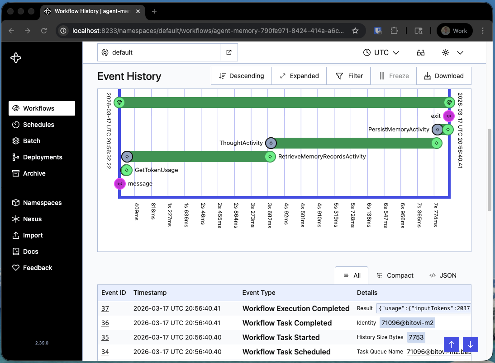
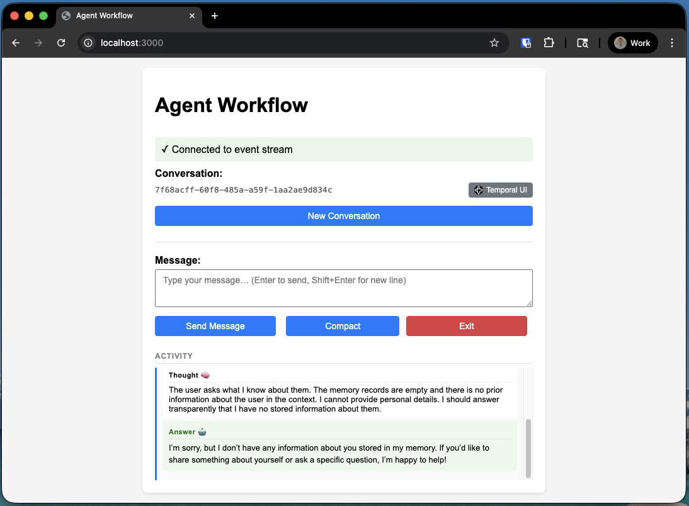
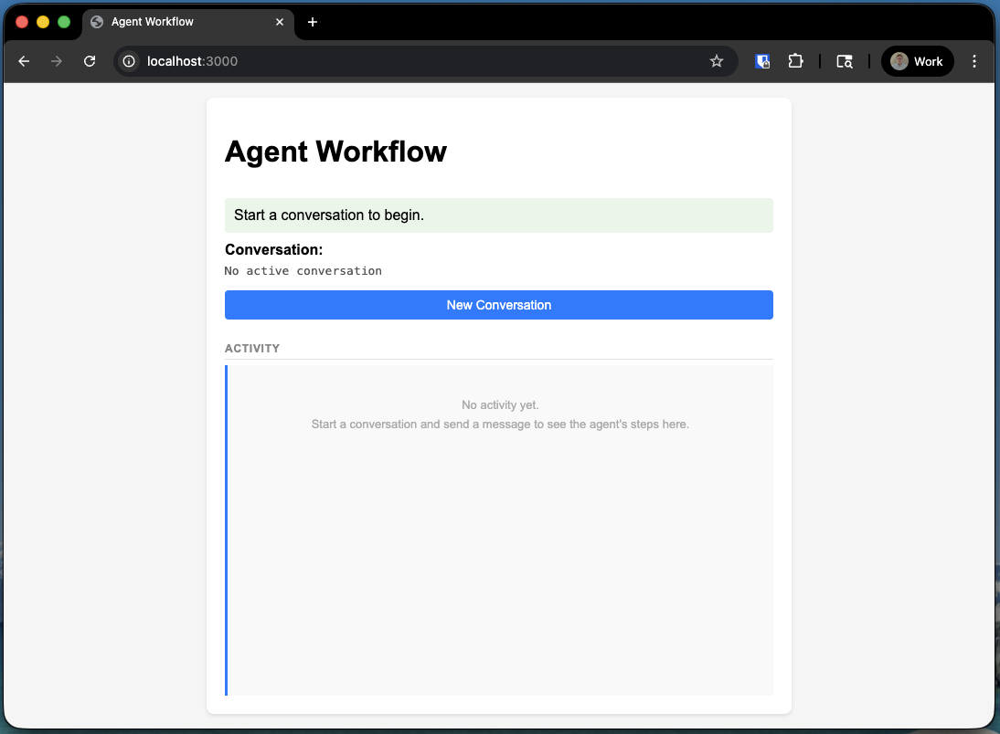
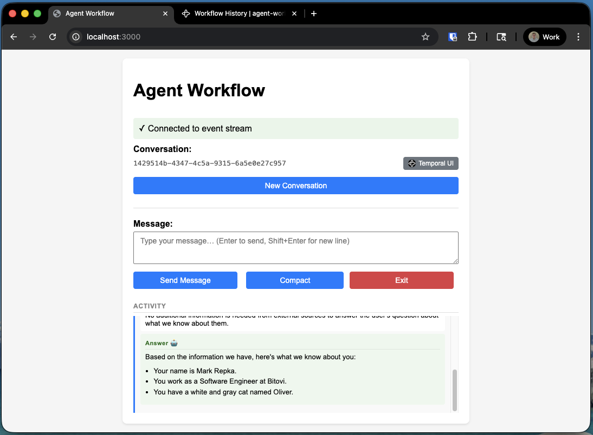
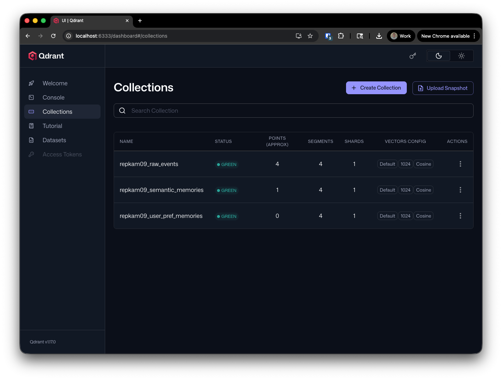
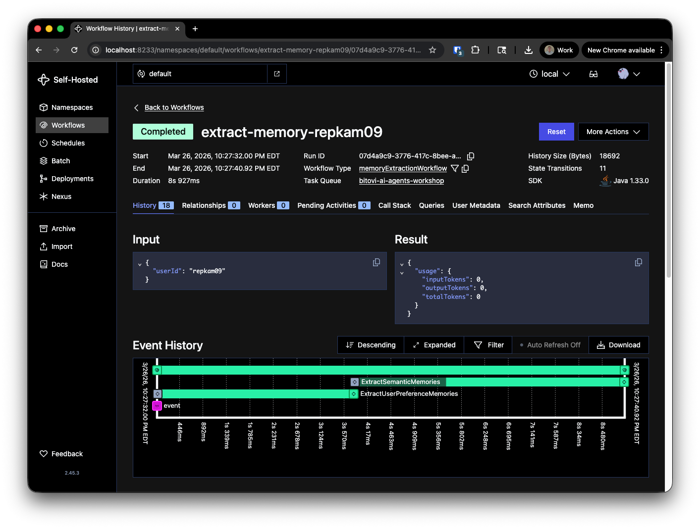

# Agent Memory

## Part A - Initial Example

First let's run the existing implementation of an agent with Long-Term Memory (LTM).

1. Update `.env` in root with your own username for `USER_ID`
2. Run Task: Sync Environments
3. Run Task: Docker Compose Down
4. Run Task: Docker Compose Up

You can access the VSCode 'Run Task' menu by pressing `Cmd+Shift+P` (Mac) or `Ctrl+Shift+P` (Windows/Linux) and typing "Run Task".


Select the appropriate task from the list to run.


5. Launch: Exercise 7 - Worker
6. Launch: Exercise 7 - Client

You can access the VSCode 'Run and Debug' panel by pressing `Cmd+Shift+D` (Mac) or `Ctrl+Shift+D` (Windows/Linux) and selecting the appropriate launch configuration.

At the top of the panel, you can select the configuration to launch.


Let's open the latest workflow in the [temporal ui](http://localhost:8233/) so we can observe the behavior of the agent.



Click on the Thought Activity to see the question asked and answered.

Notice how in `AgentMemoryClient.java` we asked the agent what it knew about us. If we haven't interacted with the agent yet, it shouldn't have any LTM about us yet.

If we open the [Chat Web UI](http://localhost:3000/) and start a conversation, and ask the agent what it knows about us, we can verify that it doesn't have any Long-Term Memory about us yet.



## Part B - Building Long-Term Memory with AgentCore

Now let's interact with the agent to build up some Long-Term Memory and observe how it persists across conversations.
The goal here is to teach the agent about your personal preferences and domain-specific knowledge so it can tailor its responses in future conversations.

1. Open the [Chat Web UI](http://localhost:3000/) and start a conversation.



2. Tell your agent about some of your personal preferences. Here are some examples that might help:

- **Communication Tone**: "I prefer short, bullet-point answers" or "Use a very formal tone".
- **Skill Level**: "Explain things to me like I'm a beginner" or "Assume I have a PhD in Physics".
- **Avoidance Lists**: "Never suggest recipes containing peanuts" or "Don't mention politics".

3. Share some facts or domain knowledge with your agent. Here are some examples that might help:

- **Acronyms**: "In our company, 'TL' always means Team Lead, not Tech Lead".
- **Projects**: "Project Nighthawk is the internal codename for our mobile app rewrite launching in Q3".
- **Definitions**: "When we say 'the platform', we mean our internal developer tooling monorepo, not the customer-facing product".

4. After a few minutes, start a completely new conversation.
5. Interact with the agent. Observe that the agent should be able to "remember" your personal preferences from a previous conversation.



> **Note:** During this exercise, if you want to start fresh with no memories:
>
> 1. Update `USER_ID` in your root `.env` file to a new unique value (e.g. `mhaynie1`, `mhaynie2`, ...).
> 2. Re-run the **Sync Environments** task.
> 3. Restart the worker.
> 4. Start a new conversation/workflow.

## Part C - Exploring Memory Strategies

Now that the agent has built up some memory, let's look at what it actually stored and how memory strategies differ.

AWS Bedrock AgentCore provides several built-in memory strategy types. The following four were enabled when we configured the memory resource in AWS:

| Strategy          | What it stores                                                                                          |
| ----------------- | ------------------------------------------------------------------------------------------------------- |
| `USER_PREFERENCE` | User preferences, choices, and interaction styles learned over time ("I prefer bullet points")          |
| `SEMANTIC`        | Key facts, entities, and contextual knowledge extracted from conversations ("User works at Acme Corp")  |
| `SUMMARIZATION`   | Condensed per-session summaries covering key topics, tasks, and decisions discussed                     |
| `EPISODIC`        | Structured records of meaningful interaction moments, organized for efficient retrieval across sessions |

As we saw in the slides, AgentCore Memory does also allow for custom memory strategies if you need to store and retrieve information in a way that doesn't fit the defaults.

### Listing all memory records

1. Open `ListMemoryRecords.java`. Notice the `strategyTypes` list at the top of `main` — by default it shows `USER_PREFERENCE` and `SEMANTIC` records.
2. Run the **Launch: ListMemoryRecords** launch config and observe the output. You should see entries like:

   ```plain
   [USER_PREFERENCE]: {"preference":"Favorite color is blue","categories":["color","personal preferences"]}
   [SEMANTIC]: {"fact":"User's favorite color is blue"}
   ```

3. Now uncomment `EPISODIC` and `SUMMARIZATION` and re-run to compare the output:

   ```java
   var strategyTypes = List.of(
       MemoryStrategyType.EPISODIC,
       MemoryStrategyType.USER_PREFERENCE,
       MemoryStrategyType.SEMANTIC,
       MemoryStrategyType.SUMMARIZATION
   );
   ```

   Notice how the same underlying fact ("favorite color is blue") is represented very differently across strategies — as a typed preference object, a plain semantic fact, a timestamped narrative episode, and inside a condensed session summary.

### Semantic Search Over Memory

`RetrieveMemoryRecords.java` queries memory using semantic search rather than listing all records. Records are returned ranked by their relevance to your query.

1. Open `RetrieveMemoryRecords.java`. Like above, the `strategyTypes` list controls which strategies are searched.
2. Run the **Launch: RetrieveMemoryRecords** launch config. The default query is `"What do you remember about me?"` searching across `USER_PREFERENCE` and `SEMANTIC`.
3. Try changing the query string to something more specific, for example:
   - `"What are my communication preferences?"`
   - `"What facts do you know about my work?"`
4. Uncomment `EPISODIC` and `SUMMARIZATION` to include those strategies and re-run. Notice how results are now ranked by relevance across all four strategy types.

## Part D - Enriching the Agent's Memory Context

The workflow currently retrieves `USER_PREFERENCE` and `SEMANTIC` records at the start of each conversation. AWS Bedrock AgentCore also produces `EPISODIC` and `SUMMARIZATION` records — let's connect those to the agent and observe the difference.

### Step 1 - Observe the baseline

Before making any changes, start a new conversation in the [Chat Web UI](http://localhost:3000/) and ask the agent questions that require broader context:

- "What have we talked about before?"
- "Give me a summary of our last conversation."
- "What do you remember about our previous interactions?"

Notice that the agent's answers are limited — it can recall facts and preferences, but it has no structured episode history or session summaries to draw from.

### Step 2 - Enable richer memory strategies

Open `AgentMemoryWorkflowImpl.java` and find the `retrieveMemoryRecordsActivity` call. Uncomment `MemoryStrategyType.EPISODIC` and `MemoryStrategyType.SUMMARIZATION` so the list looks like this:

```java
// TODO_MEMORY: Uncomment MemoryStrategyType.EPISODIC and SUMMARIZATION to enable richer memory context (Part D)
List<MemoryStrategyType> memoryStrategies = List.of(
    MemoryStrategyType.EPISODIC,
    MemoryStrategyType.USER_PREFERENCE,
    MemoryStrategyType.SEMANTIC,
    MemoryStrategyType.SUMMARIZATION
);
```

Then restart the worker.

### Step 3 - Compare

Start a new conversation and ask the same questions again.

With `EPISODIC` and `SUMMARIZATION` enabled the agent now has access to structured interaction records and condensed session summaries, giving it a much richer picture of your conversation history.

Compare the responses to what you saw in Step 1.

## Part E - Building Long-Term Memory with Local Memory Extraction

Experiment with the Local Memory Extraction Workflow by setting `LOCAL_MEMORY_EXTRACTION=true` in your `.env` file and then restarting the worker.

You can find the source code for the Local Memory Extraction Workflow in [`MemoryExtractionWorkflowImpl.java`](src/main/java/bitovi/workflow/MemoryExtractionWorkflowImpl.java).

For Semantic Memory Extraction you can refer to [`SemanticHelper.java`](src/main/java/bitovi/common/local/SemanticHelper.java).

For User Preference Memory Extraction you can refer to [`UserPreferenceHelper.java`](src/main/java/bitovi/common/local/UserPreferenceHelper.java).

Now let's interact with the agent to build up some Long-Term Memory and observe how it persists across conversations.

1. Open the [Chat Web UI](http://localhost:3000/) and start a conversation.


2. Tell your agent about some of your personal preferences. Here are some examples that might help:

- **Communication Tone**: "I prefer short, bullet-point answers" or "Use a very formal tone".
- **Skill Level**: "Explain things to me like I'm a beginner" or "Assume I have a PhD in Physics".
- **Avoidance Lists**: "Never suggest recipes containing peanuts" or "Don't mention politics".

3. Share some facts or domain knowledge with your agent. Here are some examples that might help:

- **Acronyms**: "In our company, 'TL' always means Team Lead, not Tech Lead".
- **Projects**: "Project Nighthawk is the internal codename for our mobile app rewrite launching in Q3".
- **Definitions**: "When we say 'the platform', we mean our internal developer tooling monorepo, not the customer-facing product".

4. After a few minutes, start a completely new conversation.
5. Interact with the agent. Observe that the agent should be able to "remember" your personal preferences from a previous conversation.


6. Open the [Qdrant Dashboard](http://localhost:6333/dashboard#/collections) and inspect the stored vectors. You should see entries corresponding to the facts and preferences you shared with the agent.



7. Take a look at the Temporal Web UI at [http://localhost:8233](http://localhost:8233) and inspect the workflows. You should see new workflow instances corresponding to the memory extraction and storage processes triggered by your interactions with the agent.


