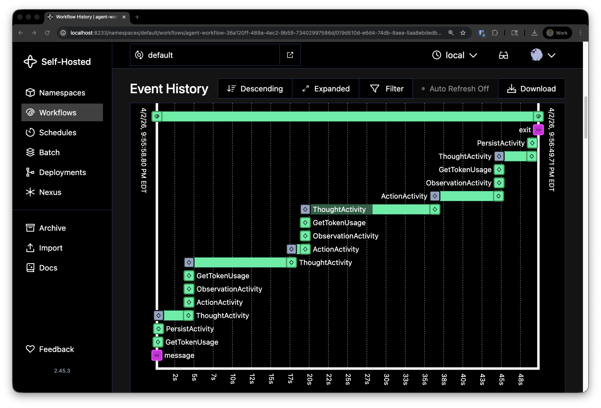
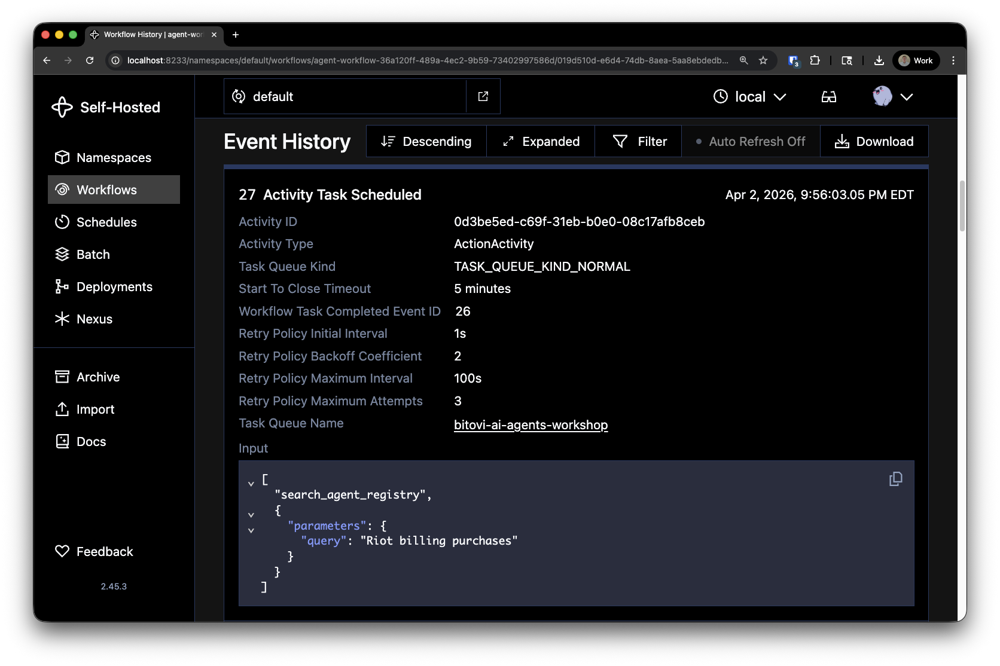
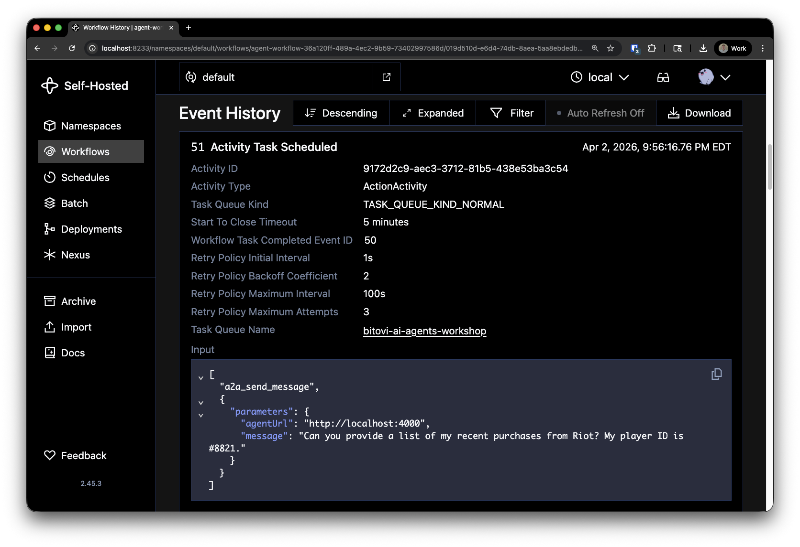

# Agent to Agent

## Part A - Initial Example

First let's run the existing implementation and see the local agent communicate with a remote Riot Games support agent via the A2A protocol. In this case the remote agent is hosted in our running Docker Compose environment, but it could just as easily be a third-party agent running on a public endpoint.

1. Run Task: Sync Environments
2. Run Task: Docker Compose Down
3. Run Task: Docker Compose Up

You can access the VSCode 'Run Task' menu by pressing `Cmd+Shift+P` (Mac) or `Ctrl+Shift+P` (Windows/Linux) and typing "Run Task".

Select the appropriate task from the list to run.

4. Launch: Exercise 8 - Worker
5. Launch: Exercise 8 - Client

You can access the VSCode 'Run and Debug' panel by pressing `Cmd+Shift+D` (Mac) or `Ctrl+Shift+D` (Windows/Linux) and selecting the appropriate launch configuration.

At the top of the panel, you can select the configuration to launch.

The client (`AgentToAgentClient.java`) sends a simple question: *"What purchases have I made from Riot recently?"*

Let's open the latest workflow in the [Temporal UI](http://localhost:8233/) so we can observe the agent's behavior.

Notice how the workflow loops through the THOUGHT, ACTION, and OBSERVATION activities - the same ReAct pattern from previous exercises.

Click on the **Action Activity** to see the tool calls:

1. First, the agent calls `search_agent_registry` to discover which remote agents are available
2. Then it calls `a2a_send_message` to contact the Riot Games Support Agent
3. The support agent looks up the account and returns billing information

Look at the observation that comes back - it contains structured JSON with the response from the remote agent. The personal assistant never sees the support agent's internal tools or reasoning, only the final result.

Action Activity: `search_agent_registry`

Action Activity: `a2a_send_message`

## Part B - Interactive Billing Dispute

Now let's try the full multi-turn A2A experience using the Chat Web UI. This is where A2A really shines - the support agent will pause mid-conversation to ask for identity verification, demonstrating the `input-required` state.

1. Make sure Docker Compose is still running (from Part A)
2. Make sure Exercise 8 - Worker is still running (from Part A)
3. Open the [Chat Web UI](http://localhost:3000/)

4. Tell the agent something like:

   > "I got charged twice for the Battle Pass in Valorant. Can you help?"

5. Watch the activity log in the UI - you'll see:
   - The agent discovers the Riot Games Support Agent
   - It opens an A2A task and the support agent starts working
   - The support agent looks up the account and finds the duplicate charge
   - The support agent pauses with `input-required` to ask for identity verification
   - The personal assistant relays the question to you

6. Respond with your verification info. The agent already knows your email (`mark@example.com`) from its profile, so it may handle this automatically. If it asks you directly, provide it.

7. After verification, the support agent will **offer you resolution options**:
   - **Full refund** ($9.99 back to your payment method)
   - **Valorant Points credit** (bonus VP worth ~10% more)
   - **Exclusive skin bundle + bonus VP**

8. Tell the agent which option you prefer and watch it apply the resolution.

9. The support agent emits a **structured artifact** with the confirmation details (confirmation number, amount, status, etc.)

### What to Notice

- **Opacity**: Your personal assistant can't see the support agent's internal tools (`lookup_account`, `check_billing_history`, `verify_identity`, etc.). It only sees status updates and the final result.
- **Multi-turn**: The conversation spans multiple A2A round-trips. Between rounds, Temporal's `Workflow.await()` durably suspends the workflow - no resources held.
- **`input-required` state**: The support agent pauses to ask for verification. This maps naturally onto Temporal's signal-and-wait pattern.
- **Artifacts**: The resolution receipt is delivered as structured data (DataPart), not just text.

